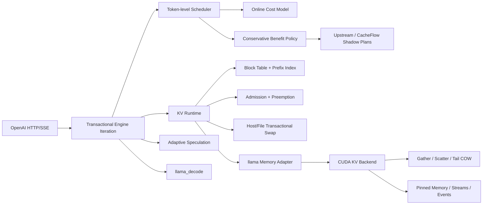

# CacheFlow Runtime

CacheFlow Runtime 是一个直接重构 llama.cpp 推理热路径的单机 LLM Serving / AI Infra 项目。它不是 Python 包装层，也不把 `vendor/` 中的上游源码算作个人工作量：个人实现以固定上游 `acd79d603` 为基线，通过可重放 patch 进入真实 `llama-server -> llama_decode -> KV memory -> CUDA` 调用链。

当前 fork 相对固定上游涉及 59 个文件，新增 8,445 行、删除 99 行 C/C++/CUDA；最终以可重放 patch 的 `git diff --stat` 为准。外层 Python 仅负责固定实验、故障注入和报告。

## 实现了什么



- Serving：Token-level Continuous Batching、Decode 优先、Chunked Prefill、公平轮转、取消、Deadline、背压和 OpenAI 流式/非流式接口。
- Runtime：不可变 iteration plan 与 prepare/execute/commit/abort 事务；统一 KV 容量规划；Prefix Block Table、引用计数、COW、抢占与恢复。
- 模型侧控制：按 CPU/CUDA、并发和上下文在线更新成本模型，自适应选择 Prefill Chunk；按接受率证据、迟滞和 KV 压力调整 Speculative Draft 长度。
- 收益门控：生产路径同时生成 upstream/CacheFlow prefill plan；CPU/CUDA 分模，只有置信收益下界为正才启用，并具有有限探索、KV 压力/漂移回退和 paired oracle 验收。
- GPU Backend：自研 FP16 K/V Gather、Scatter、Snapshot-safe 重叠拷贝和 Tail COW CUDA Kernel；异步 Pinned Host Swap、独立 Stream/Event、`cudaMallocAsync`、错误回滚与统计。
- 存储：有容量预算、校验和、临时文件原子提交及故障注入的 Host/File KV Swap Store。
- 可观测性：原生 TTFT/TPOT/请求/排队 Histogram，以及 Scheduler、KV、Speculation、CUDA Kernel、传输字节、Event 时间和 Pinned Pool 指标。

详细状态所有权、接口、失败语义和复杂度见 [架构文档](docs/architecture.md)，验收证据见 [验收报告](docs/acceptance-report.md)。

## 可复现结果

固定环境：Windows 11、RTX 4050 Laptop 6 GiB、i5-13500H、CUDA sm_89、Qwen2.5-0.5B-Instruct Q4/Q8/F16。

- 真实 Tail COW：64 个 Block 的整序列复制替换为单 Tail Block，最终轮 P95 从 0.998 ms 降至 0.026 ms；复制量/额外显存从 12,582,912 B 降至 196,608 B，launch 从 128 降至 1。
- 真实 CUDA Swap：Qwen KV 经 D2H/H2D Pinned Memory 往返后序列状态逐字节一致，Event 时间和 319,488 B Pinned 峰值来自实际运行。
- 上游兼容：固定相同 MSVC 工具链、模型和 seed，`upstream` policy 5/5 输出 SHA-256 一致。
- 模型矩阵：Q4/Q8/F16 × CPU/CUDA、并发 1/2/4/8、约 128/512/2K/4K 上下文共 14 个真实服务 case 通过。
- Adaptive Speculation：当前 CUDA trace 的 wall-time 中位数 196.18 ms，fixed 为 202.58 ms；CPU adaptive 中位数也略优于 fixed。
- Adaptive Prefill：CUDA 在线 cost model 在最终轮避开错误 fixed-64，但略劣于 greedy/fixed-256；CPU 历史在线动作曾劣于所有候选，现按 backend bucket 选择 `chunk=0` greedy 安全动作，并由 2% 回归门槛阻止再次静默退化。
- Gather/Scatter：完全不重叠时 per-block memcpy 更快，因此生产实现只在重叠/重复映射需要 snapshot 语义时使用 staging kernel。
- Mixed prefill/decode：CPU 在两轮 3-trial 验收中都改善尾延迟/吞吐；CUDA 两轮的 latency/吞吐结论反号，虽然 TTFT P95 均改善，但样本不足以声称稳定端到端收益，因此当前不应对所有 CUDA workload 默认启用。
- Conservative Benefit Gating：最终 CPU/CUDA 各 10-trial Latin 验收中，CPU learned objective median 4177.39 ms、paired upstream regression -18.11%、paired-oracle regret 15.35%；CUDA 190.70 ms、paired regression -2.82%、paired-oracle regret 1.02%。两端均通过原 3%/20% 与 harmful wrong-enable 门槛。短生命周期采用 backend-local 风险预算：CPU 15 次有限探索，CUDA 0 次 probe 并 fail closed；positive-lower-bound 均为 0，不把冷启动门禁冒充在线收敛。
- 长驻在线学习：单一 CUDA server PID 连续 53 waves，生产级 `confidence_beta=1.0`、每动作最少 12 个样本；冷启动 0 次提前启用，稳定阶段 18 次探索后产生 142 次 positive-lower-bound，覆盖 33 个 wave、最长连续 13 waves；终态预测收益 21.29 ms 对不确定性 8.82 ms；切换后 0 次 CacheFlow、3 次安全回退。
- CUDA profiling 因果链：3 组 paired Latin upstream/always 干预中，强制 CacheFlow 中位使决策 +13、prefill chunk +23、prefill token -354、自研 KV kernel +2、KV copy +20,066,300 B、CUDA Event +0.808 ms，Engine execute 汇总 -11,446 us，但 TTFT P95 +85.61 ms。说明总 execute 时间下降仍可能因分块、批次顺序和请求等待结构而恶化尾延迟，单个 kernel 或 phase 汇总不能替代请求级结果；范围不冒充完整 Nsight kernel census。
- Production Engine trace：最终 CPU mixed workload 中 execute 占 99.9145%，plan 仅 0.0148%；`results/engine-flame.svg` 是 phase-duration 图，不是 sampled-stack flame graph。

所有性能 A/B 结论至少 3 次 fresh-process trial；功能 smoke 和 Engine trace 不冒充多 trial 性能结论。汇总位于 `results/`，原始 trial 位于 `results/raw/`。硬件、模型和负结果边界见 [实验限制](docs/experiment-limitations.md)。

## 一键复现

依赖：PowerShell、Git、Python 3、CMake、Ninja、Visual Studio 2022 C++ workload。仓库已在 `runtime/cuda-dev` 固定 CUDA 12.6 开发环境；模型和预编译基线由 SHA-256 清单固定。

```powershell
cd D:\llama
powershell -ExecutionPolicy Bypass -File .\scripts\bootstrap.ps1
powershell -ExecutionPolicy Bypass -File .\scripts\verify.ps1 -Full
```

`verify.ps1 -Full` 会依次执行：

1. Python 测试、语法检查、制品 SHA-256 和设备检查；
2. CPU fork、同工具链 upstream、CUDA sm_89 全部目标构建；
3. 个人 C++ 原生测试与随机状态/映射性质测试；
4. Prefix 分享、抢占恢复、真实 CUDA Tensor/Swap、OOM/Compute/Store 故障注入；
5. OpenAI/SSE、取消、Deadline、背压和恢复；
6. 上游输出兼容、模型/后端/并发/上下文矩阵；
7. Compute Sanitizer memcheck/racecheck（硬门槛）；
8. CUDA Transport/COW、Adaptive Prefill/Spec、mixed workload、Conservative Benefit Gating（CPU/CUDA 各 10 trials）、53-wave 长驻收敛和 3-pair CUDA 因果 profiling；
9. production Engine trace/flame chart，并从原始数据重新生成报告。

只做快速环境与 Python 验证：

```powershell
.\scripts\verify.ps1
```

单独执行 CUDA 内存检查：

```powershell
.\scripts\build_cuda_kv.ps1 -Sanitize
```

Windows WDDM 首次运行前需要以管理员身份执行 CUDA Toolkit 的 `EnableDebuggerInterface.bat`。`verify.ps1 -Full` 会直接执行 memcheck/racecheck，未通过即整体验收失败，并额外运行 canary、随机映射、逐元素对照和 allocation failpoint。

## 策略开关

```text
--scheduler-policy upstream|cacheflow
--prefill-policy greedy|fixed|adaptive
--benefit-policy upstream|always|rule|learned
--benefit-min-observations N
--benefit-exploration-interval N
--benefit-confidence-beta BETA
--benefit-safety-margin-ms MS
--benefit-drift-ratio RATIO
--benefit-drift-consecutive N
--benefit-cooldown-decisions N
--spec-policy fixed|adaptive
--kv-block-runtime
--kv-block-size N
--kv-admission-reserve-tokens N
```

`upstream` 模式关闭行为变化。最终生效配置会导出到 Prometheus，避免实验参数被静默忽略。完整参数和约束见 [架构文档](docs/architecture.md)。

## 生产运行

生产入口不是 benchmark 脚本，而是 `scripts/start_production.ps1`。它强制使用 API key 文件、只绑定 loopback、为每个副本建立独立在线模型 checkpoint，并用模型 SHA-256/主机/后端/批处理形态阻止错误状态恢复。真实跨进程恢复、损坏降级、指标和当前部署边界见 [生产准入与运行手册](docs/production-readiness.md)。

```powershell
.\scripts\start_production.ps1 -ModelPath .\models\qwen2.5-0.5b-instruct-q4_k_m.gguf `
  -ApiKeyFile D:\secrets\cacheflow-api-keys.txt -Backend cuda -InstanceId gpu0
```

## 代码边界

```text
vendor/llama.cpp/                 固定上游 fork；个人实现所在的真实 C++/CUDA 热路径
patches/0001-*.patch              相对固定上游的完整个人可重放差异
scripts/                         构建、真实服务测试、A/B 和报告编排
results/                         可提交汇总；raw/ 保存 fresh-process 原始数据
docs/                            架构、验收、实验限制和面试深挖
prototypes/cacheflow/            已归档的早期 Python 控制面原型，不计最终 Runtime 核心
models/ runtime/ build/          下载模型、工具链和本机构建产物，均不计个人源码
```

复用的上游部分包括 GGUF、模型 Graph、GGML 通用算子、既有 CPU/CUDA/Metal/Vulkan Backend、HTTP 基础设施和 Sampling。个人部分是 Scheduler、事务 Engine Seam、KV 资源模型、CUDA KV Kernel/Adapter、控制算法、原生 Metrics、故障注入与实验体系。不要在面试中声称“重写了 llama.cpp”。

## 面试演示主线

系统学习入口：[推免面试课程](lessons/index.html)；现已增加真正零基础的模型/数学/程序并发/GPU 四节桥接课。配套的 [18 天学习路线](docs/interview-study-roadmap.md)、[术语表](reference/glossary.html)、[公式/代码地图](reference/formulas-and-code-map.html) 和 [25 道追问题库](reference/interview-question-bank.html)，从输入一句话一直覆盖到项目算法、实验和答辩训练。

三分钟版本：

1. 展示 `server_inference_iteration` 如何禁止半执行计划提交；
2. 展示 Block Table 的共享、COW 和容量守恒随机测试；
3. 展示 `llama-kv-cache-paged.cu` 中真实 K/V Tensor 的 CUDA Copy/Swap；
4. 运行 OpenAI SSE smoke 并读取原生 Histogram/CUDA Metrics；
5. 对比 Tail COW 的 bytes、launch、P95，再主动解释 Gather/Scatter 和 Adaptive Prefill 的负结果。

追问框架见 [面试笔记](docs/interview-notes.md)。

## 来源与许可证

- llama.cpp：MIT，固定 `b9632 / acd79d603cb2e1c84c0886137b80f1ad649b6857`。
- Qwen2.5-0.5B-Instruct-GGUF：Apache-2.0，固定 revision `9217f5db79a29953eb74d5343926648285ec7e67`。
- 第三方源码、模型和构建产物不计个人工作量；各自许可证独立生效。
