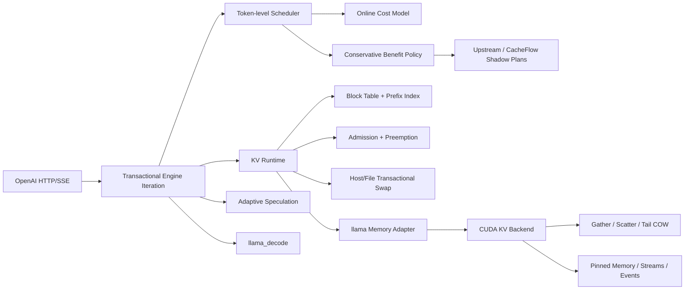

# CacheFlow Runtime

CacheFlow Runtime 是一个直接重构 llama.cpp 推理热路径的单机 LLM Serving / AI Infra 项目。它不是 Python 包装层，也不把 `vendor/` 中的上游源码算作个人工作量：个人实现以固定上游 `acd79d603` 为基线，通过可重放 patch 进入真实 `llama-server -> llama_decode -> KV memory -> CUDA` 调用链。

当前 fork 相对固定上游涉及 69 个文件，新增 11,030 行、删除 99 行 C/C++/CUDA；最终以可重放 patch 的 `git diff --stat` 为准。外层 Python 仅负责固定实验、故障注入和报告。

## 实现了什么



- Serving：Token-level Continuous Batching、Decode 优先、Chunked Prefill、公平轮转、取消、Deadline、背压和 OpenAI 流式/非流式接口。
- Runtime：不可变 iteration plan 与 prepare/execute/commit/abort 事务；统一 KV 容量规划；Prefix Block Table、引用计数、COW、抢占与恢复。
- 模型侧控制：按 CPU/CUDA、并发和上下文在线更新成本模型，自适应选择 Prefill Chunk；按接受率证据、迟滞和 KV 压力调整 Speculative Draft 长度。
- 收益门控：生产路径同时生成 upstream/CacheFlow prefill plan；CPU/CUDA 分模，只有置信收益下界为正才启用，并具有有限探索、KV 压力/漂移回退和 paired oracle 验收。
- GPU Backend：自研 FP16 K/V Gather、Scatter、Snapshot-safe 重叠拷贝和 Tail COW CUDA Kernel；异步 Pinned Host Swap、独立 Stream/Event、`cudaMallocAsync`、错误回滚与统计。
- 存储：有容量预算、校验和、临时文件原子提交及故障注入的 Host/File KV Swap Store。
- 可观测性：原生 TTFT/TPOT/请求/排队 Histogram，以及 Scheduler、KV、Speculation、CUDA Kernel、传输字节、Event 时间和 Pinned Pool 指标。

详细状态所有权、接口、失败语义和复杂度见 [架构文档](docs/architecture.md)，验收证据见 [验收报告](docs/acceptance-report.md)。

## 可复现结果

固定环境：Windows 11、RTX 4050 Laptop 6 GiB、i5-13500H、CUDA sm_89、Qwen2.5-0.5B-Instruct Q4/Q8/F16。

- 真实 Tail COW：64 个 Block 的整序列复制替换为单 Tail Block，最终轮 P95 从 0.998 ms 降至 0.026 ms；复制量/额外显存从 12,582,912 B 降至 196,608 B，launch 从 128 降至 1。
- 真实 CUDA Swap：Qwen KV 经 D2H/H2D Pinned Memory 往返后序列状态逐字节一致，Event 时间和 319,488 B Pinned 峰值来自实际运行。
- 上游兼容：固定相同 MSVC 工具链、模型和 seed，`upstream` policy 5/5 输出 SHA-256 一致。
- 模型矩阵：Q4/Q8/F16 × CPU/CUDA、并发 1/2/4/8、约 128/512/2K/4K 上下文共 14 个真实服务 case 通过。
- Adaptive Speculation：当前 CUDA trace 的 wall-time 中位数 196.18 ms，fixed 为 202.58 ms；CPU adaptive 中位数也略优于 fixed。
- Adaptive Prefill：CUDA 在线 cost model 在最终轮避开错误 fixed-64，但略劣于 greedy/fixed-256；CPU 历史在线动作曾劣于所有候选，现按 backend bucket 选择 `chunk=0` greedy 安全动作，并由 2% 回归门槛阻止再次静默退化。
- Gather/Scatter：完全不重叠时 per-block memcpy 更快，因此生产实现只在重叠/重复映射需要 snapshot 语义时使用 staging kernel。
- Mixed prefill/decode：CPU 在两轮 3-trial 验收中都改善尾延迟/吞吐；CUDA 两轮的 latency/吞吐结论反号，虽然 TTFT P95 均改善，但样本不足以声称稳定端到端收益，因此当前不应对所有 CUDA workload 默认启用。
- Conservative Benefit Gating：最终将 `backend×mode` 视为 8 个联合treatment，运行16 trial（两个完整Williams blocks）；每个联合treatment在8个真实进程位置各出现2次，56条有向直接前驱也各出现2次，trial边界用1秒显式washout隔离。真实 socket send seam固定每波顺序并保持响应/SSE重叠，128/128 trial rows的两波observed order均为 `0..5`。CPU learned objective median 4205.21 ms、paired upstream regression -23.80%、paired-oracle regret 5.04%，CUDA 280.01 ms、paired regression +2.16%、paired-oracle regret 10.52%。两端均通过原3%/20%与harmful wrong-enable门槛；CUDA的8个harmful trials中错误启用为0。生产 `choose()` 路径导出标准Prometheus延迟直方图，CPU/CUDA learned分别覆盖139/142次决策，最坏trial P99不超过2/5 us（预注册预算50 us）。短生命周期采用backend-local风险预算：CPU 43次有限探索，CUDA 0次probe并fail closed；positive-lower-bound均为0，不把冷启动门禁冒充在线收敛，也不把零干预的跨进程噪声冒充因果效果。
- 长驻在线学习：单一 CUDA server PID 连续 53 waves，生产级 `confidence_beta=1.0`、每动作最少 12 个样本；冷启动 0 次提前启用，稳定阶段 26 次探索后产生 125 次 positive-lower-bound，覆盖 36 个 wave，最长及终端连续均为 35 waves；最后一次上下文 gauge 为预测收益 8.926 ms、不确定性 4.463 ms，但last-value gauge只作诊断，硬门禁使用可审计的逐wave动作counter；切换后 0 次 CacheFlow、3 次安全回退。逐wave CSV 保存请求级TTFT向量，验证器独立重算phase P95、streak和acceptance并覆盖篡改反例。
- CUDA profiling 因果链：3 组 paired Latin upstream/always 干预中，强制 CacheFlow 中位使决策 +13、prefill chunk +23、prefill token -354、自研 KV kernel +2、KV copy +20,066,300 B、CUDA Event +0.808 ms，Engine execute 汇总 -11,446 us，但 TTFT P95 +85.61 ms。说明总 execute 时间下降仍可能因分块、批次顺序和请求等待结构而恶化尾延迟，单个 kernel 或 phase 汇总不能替代请求级结果；范围不冒充完整 Nsight kernel census。
- Nsight KV 机制切片：4 个预注册 regime、160 条 no-profiler paired trials 和 4 份真实 NSYS trace。aligned 1 block 的 CUDA-event 改善 +57.10% [95% CI +38.51%, +57.14%]，16/32 blocks 为低于 10% 门槛的 neutral，misaligned 1 block 明确回退 137.94%；scalar/vector 在每个 trace 都是 10/10 launches，故收益不是来自减少 launch 数。NCU 因 driver compatibility 与 `ERR_NVGPUCTRPERM` 未取得硬件计数器，项目明确不声称 memory-bound、roofline 或 occupancy。
- 服务级 NSYS 关联：3 个 no-profiler pairs 与相同 seed/config 的 3 个 profiler pairs 分离，6 个 server PID、72 个 request ID 逐项连接 scheduler decision、KV action、NSYS CUDA kernel 与 TTFT，42 次 profiler replay KV launch 和逐进程运行时 counter 完全一致。本轮 no-profiler 中 decision +20、prefill chunk +30、prefill token -86、KV launch +0、copy bytes +10,518,500、CUDA Event -1.040 ms；TTFT P95/Engine execute 中位差为 +126.932 ms/+146,493 us，两者同向恶化。报告不冒充复现了旧实验的反号结果。
- Production Engine trace：最终 CPU mixed workload 中 execute 占 99.9145%，plan 仅 0.0148%；`results/engine-flame.svg` 是 phase-duration 图，不是 sampled-stack flame graph。

所有性能 A/B 结论至少 3 次 fresh-process trial；功能 smoke 和 Engine trace 不冒充多 trial 性能结论。汇总位于 `results/`，原始 trial 位于 `results/raw/`。硬件、模型和负结果边界见 [实验限制](docs/experiment-limitations.md)。

### Unified KV Action Policy

服务现在用同一个 fail-closed 接口比较 Direct、真实 CUDA Remap、受限 opt-in Paged Decode、CUDA-managed Swap、事务型 host Swap 与 Recompute。Paged 只开放 Qwen2.5-0.5B、FP16 KV、page 16、D64、单 token/batch 1、context ≤ 17 的全 GPU 路径；其他请求在 KV mutation 前回退。策略包含固定 H0、解析 A1、分桶查表 T1 与带置信边界/H0 fallback 的 L1，Prometheus 分开记录选择原因、实际动作、完整成本和失败次数。

Issue #7 的 v1.1 正式生产服务实验从干净提交 `9182882` 运行 10 组 17-token 跨页 Direct/Paged AB/BA 配对：所有输出逐字一致，Paged 真实进入 10 次 production graph、0 fallback，NSYS 在一次机制 replay 中记录 24 个 `cacheflow_paged_decode_fattn_k1<64>` layer launch；但 Paged 的 client P95 为 29.210 ms，对 Direct 的 27.354 ms 回退 6.78%，配对差中位数 +2.705 ms，bootstrap 95% 区间 [-1.185, +12.019] ms。因此预注册 +5% promotion gate 仍失败，Paged 保持 opt-in 且不会由生产策略默认选择。v1.0 因请求未跨物理页而移入 `results/research/superseded/`。该结论只覆盖本机 Qwen2.5-0.5B、batch 1、17-token context，不外推长上下文或大模型。

在同一受限 Paged 路径内，K2 已替换逐 query-head CTA 的 K1：K2 以两个 warp 组成一个 query-head tile，同一 GQA KV head 的 K/V 只装入 shared memory 一次，使用转置 K 布局规避 shared-memory bank conflict，并以 warp reduction 完成稳定 softmax。预注册 v2.2 的 30 组 K1/K2 稳态配对（每 arm 5 次真实 Paged 图，共 300 次）全部输出一致且 0 fallback；服务内部 prompt 中位数由 4.3785 ms 降至 4.1585 ms（-5.02%），客户端中位数由 6.8473 ms 降至 5.7631 ms（-15.83%），P95 由 30.1442 ms 降至 29.8194 ms（-1.08%）。PID 隔离 NSYS replay 中 24 层 kernel 总时长由 0.414371 ms 降至 0.205313 ms（-50.45%）。这证明的是 **K2 相对 K1** 在 Qwen2.5-0.5B、D64/GQA7、17-token 稳态 envelope 内通过生产替换门槛；它不会推翻上述 Paged 相对 Direct 的负结果，也不外推到长 context。

正式 Qwen2.5-0.5B CUDA v1.6 matched-workload replay 使用 120 个全新隔离 trace（60 fit/20 calibration/40 evaluation）和 600 组 hash-bound 原始 Prometheus/响应 observation。风险预算 D3 在 80 个留出决策中切换 24 次：累计 regret 从 H0 的 `42.590 ms` 降至 `2.082 ms`（下降 95.1%），P95 从 `3.169 ms` 降至 `0`，matched-workload trace-cluster mean-regret delta 95% CI 为 `[-0.7232, -0.3069] ms`；1 次 harmful 按预注册的全部 eligible decisions 分母为 1.25%，按实际切换分母为 4.17%，两种经验比例均低于 5%，累计收益 `41.480 ms` 覆盖累计损失 `0.972 ms`。该点估计不证明总体 harmful risk 的 95% 上界低于 5%。四个 action server 是独立进程，action 与 process 存在混杂；artifact 中保留的 `paired_trace_cluster...` 字段是历史统计字段名，不满足本仓库 Trial Pair 的同热进程定义，也不支持动作因果归因。D1/D2 仍 0 次切换，T1 为 `18.061 ms` 且同样有 1 次 harmful。D3 的通过只授权后续同进程 monitored canary，当前生产 selector 仍不自动启用学习策略。决策开销基准 p99 0.900 us、decision/action ratio p99 0.0874%、零 allocation；该开销来自现有有界生产 chooser seam，D3 仍是离线候选。v1.4/v1.5 负结果均完整保留，未被成功版本覆盖。

## 一键复现

依赖：PowerShell、Git、Python 3、Node.js 22.14.0（由 `.nvmrc` 固定，仅用于前端语法门禁）、CMake、Ninja、Visual Studio 2022 C++ workload。仓库已在 `runtime/cuda-dev` 固定 CUDA 12.6 开发环境；模型和预编译基线由 SHA-256 清单固定。

```powershell
cd D:\llama
powershell -ExecutionPolicy Bypass -File .\scripts\bootstrap.ps1
powershell -ExecutionPolicy Bypass -File .\scripts\verify.ps1 -Full
```

`verify.ps1 -Full` 会依次执行：

1. Python 测试、语法检查、制品 SHA-256 和设备检查；
2. CPU fork、同工具链 upstream、CUDA sm_89 全部目标构建；
3. 个人 C++ 原生测试与随机状态/映射性质测试；
4. Prefix 分享、抢占恢复、真实 CUDA Tensor/Swap、OOM/Compute/Store 故障注入；
5. OpenAI/SSE、取消、Deadline、背压和恢复；
6. 上游输出兼容、模型/后端/并发/上下文矩阵；
7. Compute Sanitizer memcheck/racecheck（硬门槛）；
8. CUDA Transport/COW、Adaptive Prefill/Spec、mixed workload、Conservative Benefit Gating（16-trial联合 backend×mode Williams blocks）、53-wave 长驻收敛和 3-pair CUDA 因果 profiling；
9. production Engine trace/flame chart，并从原始数据重新生成报告。

只做快速环境与 Python 验证：

```powershell
.\scripts\verify.ps1
```

单独执行 CUDA 内存检查：

```powershell
.\scripts\build_cuda_kv.ps1 -Sanitize
```

Windows WDDM 首次运行前需要以管理员身份执行 CUDA Toolkit 的 `EnableDebuggerInterface.bat`。`verify.ps1 -Full` 会直接执行 memcheck/racecheck，未通过即整体验收失败，并额外运行 canary、随机映射、逐元素对照和 allocation failpoint。

## 策略开关

```text
--scheduler-policy upstream|cacheflow
--prefill-policy greedy|fixed|adaptive
--benefit-policy upstream|always|rule|learned
--benefit-min-observations N
--benefit-exploration-interval N
--benefit-confidence-beta BETA
--benefit-safety-margin-ms MS
--benefit-drift-ratio RATIO
--benefit-drift-consecutive N
--benefit-cooldown-decisions N
--spec-policy fixed|adaptive
--kv-block-runtime
--kv-block-size N
--kv-admission-reserve-tokens N
```

`upstream` 模式关闭行为变化。最终生效配置会导出到 Prometheus，避免实验参数被静默忽略。完整参数和约束见 [架构文档](docs/architecture.md)。

## 生产运行

生产入口不是 benchmark 脚本，而是 `scripts/start_production.ps1`。它强制使用 API key 文件、只绑定 loopback、为每个副本建立独立在线模型 checkpoint，并用不可覆盖的模型 SHA-256/主机/后端/批处理形态身份阻止错误状态恢复。真实跨进程恢复、损坏降级、指标和当前部署边界见 [生产准入与运行手册](docs/production-readiness.md)。

```powershell
.\scripts\start_production.ps1 -ModelPath .\models\qwen2.5-0.5b-instruct-q4_k_m.gguf `
  -ApiKeyFile D:\secrets\cacheflow-api-keys.txt -Backend cuda -InstanceId gpu0
```

## 真实用户应用

`llama-server` 之外新增了可直接使用的“研途”推免面试学习助手。它读取现有 408、机器学习、数据库、编译原理和数学资料，提供带来源引用的检索增强回答、多轮流式会话、SQLite 持久化和应用重启续聊；浏览器不接触模型 API key。

先按上节启动 CacheFlow Runtime，再在另一个终端启动应用：

```powershell
.\scripts\start_interview_assistant.ps1 `
  -ApiKeyFile D:\secrets\cacheflow-api-keys.txt `
  -KnowledgeRoot D:\exam\tuimian-monitor\docs\study
```

访问 `http://127.0.0.1:8766`。真实 CUDA 用户旅程不是单请求 smoke：它启动并重启两个独立应用进程，完成三轮带引用回答、真实模型 token 后取消、429 背压和两个用户并发，并从原生指标验证 456 个缓存 prompt token、6 次 CUDA KV kernel、5,603,330 个向量化 Remap byte、2 次 CUDA 收益决策与 2 次 checkpoint。真实 Chromium 浏览器交互也已通过；证据见 `results/user-application-journey.json` 与 `results/user-application-browser-qa.json`，详细边界见 [用户应用说明](docs/user-application.md)。

## 向量化 CUDA KV Remap

真实模型 KV tensor 的跨 stream Gather/Scatter 现使用 descriptor-driven 128-bit `uint4` 算子；源、目的或 staging 不满足 16-byte 对齐时自动走标量路径，尾部不足 8 个 FP16 元素时安全回退。20 组配对、交替顺序微基准中，1/4/16/32 Block 的 GPU 中位耗时相对标量分别改善 53.33%/48.89%/3.13%/1.87%，不将微基准结果冒充端到端加速。研究边界见 [科研型项目报告](docs/research-project-report.md)，可直接使用的中文简历版本见 [简历项目经历](docs/resume-project-experience.md)。

## Copy-aware Paged KV 研究计划

后续研究不把当前 Remap 冒充 PagedAttention。[研究方向 ADR](docs/adr/0001-copy-aware-paged-kv-research-direction.md)将首个切片限定为 Qwen2.5、FP16 KV、GQA、单 token decode 和消费级单 GPU；[一手资料与基线审计](docs/research/primary-source-foundations.md)区分本机可复现的 upstream/Direct/Scalar Remap/Vector Remap/固定规则基线与只能作为相关工作的外部系统，[可证伪研究章程](docs/research/research-charter.md)则锁定变量、机制、证伪条件与负结果规则。机器可校验的基线和主张分别位于 [`config/research_baselines.json`](config/research_baselines.json) 与 [`config/research_claims.json`](config/research_claims.json)，科研路线按 [GitHub Issue #1](https://github.com/Ljzljz-211302/cacheflow-llama-runtime/issues/1) 的依赖图执行。

[确认性实验协议](docs/research/experiment-protocol.md)进一步冻结 warm-up、种子化随机 Trial Pair、host enqueue/CUDA Event/end-to-end 三种计时、paired bootstrap CI、无事后删异常和 CPU-only correctness fallback。`scripts/run_research_experiment.py` 用一个命令生成带 provenance 的 `manifest.json` 与逐行 `trials.jsonl`；方法学依据见 [实验协议一手资料](docs/research/experiment-protocol-foundations.md)。

Issue #5 已实现第一版受限 Paged Decode Attention，而非继续用 Remap 冒充 attention：K1 CUDA kernel 以每个 `(sequence, query_head)` 一个 CTA，直接从非连续物理页读取 FP16 K/V，用 FP32 online softmax 产生真实 FP32 attention output。它覆盖本地 Qwen2.5-0.5B 的 `14Q/2KV/D64` 与 7B 模型几何的 `28Q/4KV/D128`，page size 固定 16，unsupported shape/context/page table fail closed；D128 结果不代表本机完成了 7B 端到端服务。

已执行研究工作并非只有 Issue #7：Issue #2/#3 固定可证伪问题与预注册协议，Issue #4 建立 CUDA/NSYS 因果链，Issue #5 实现受限 Paged Decode kernel，Issue #6 建立统一候选动作接口，但其正式 H0/A1/T1/L1 replay 只覆盖 Direct、device/host Swap、Recompute，Remap/Paged 当时被 capability-mask；Issue #7 才另行接入真实 Remap/Paged，Issue #10 审计一手资料与可复现基线。完整映射见 [严格验收报告](docs/acceptance-report.md#已执行-issue-覆盖)。Issue #8/#9 仍是待完成的消融、外部有效性和最终论文式发布，不计入当前成果。

K1 frontier artifact 含 9 个 regime、360 条无 profiler paired observations 和 4 份方法隔离 NSYS trace。每个 regime 在计时前均由独立 CPU FP32 oracle 验证，最大绝对误差 `3.6e-8`。相对相同数学的 contiguous CUDA 对照，0.5B 的 16-token case 为 neutral，17-token case 出现高噪声的 +22.87% 中位改善但区间跨过材料性门槛，不能宣称稳定获益；所有 medium/long regime 则回退 10.41%–13.05%。本地 0.5B 的 context 1024/batch 1 回退 13.05%（95% CI 12.91%–13.12%），7B shape 对应回退 11.59%（11.37%–11.78%）。预注册 split-K 条件未触发，规则当时选择 K2 GQA KV reuse；K2 现已在受限生产 envelope 内实现并通过独立 v2.2 K1/K2 晋级实验。实验绑定 RTX 4050 `sm_89`、6141 MiB 显存。NCU 因 driver incompatibility 与 `ERR_NVGPUCTRPERM` 不完整，因此禁止 memory-bound、occupancy 和硬件 DRAM-byte 归因；K2 的解释只使用代码干预、输出正确性、服务计时与 NSYS kernel identity/duration。详见 [受限设计与一手资料](docs/research/restricted-paged-decode-attention.md)、[K1 frontier 报告](results/research/h3-paged-decode-v1.0.0/report.md)及[K2 正式报告](results/research/h8-k2-production-v2.2.0/report.md)。

## 代码边界

```text
vendor/llama.cpp/                 固定上游 fork；个人实现所在的真实 C++/CUDA 热路径
patches/0001-*.patch              相对固定上游的完整个人可重放差异
scripts/                         构建、真实服务测试、A/B 和报告编排
results/                         可提交汇总；raw/ 保存 fresh-process 原始数据
docs/                            架构、验收、实验限制和面试深挖
prototypes/cacheflow/            已归档的早期 Python 控制面原型，不计最终 Runtime 核心
models/ runtime/ build/          下载模型、工具链和本机构建产物，均不计个人源码
```

复用的上游部分包括 GGUF、模型 Graph、GGML 通用算子、既有 CPU/CUDA/Metal/Vulkan Backend、HTTP 基础设施和 Sampling。个人部分是 Scheduler、事务 Engine Seam、KV 资源模型、CUDA KV Kernel/Adapter、控制算法、原生 Metrics、故障注入与实验体系。不要在面试中声称“重写了 llama.cpp”。

## 面试演示主线

只使用一份材料时，直接阅读 [《CacheFlow Runtime：从零到项目面试完全手册》](lessons/cacheflow-runtime-complete-interview-handbook.html)；它统一覆盖基础、架构、算法、CUDA、实验、源码地图、53 道追问和 14 天训练。分课入口仍见 [推免面试课程](lessons/index.html)，并配有 [18 天学习路线](docs/interview-study-roadmap.md)、[术语表](reference/glossary.html)、[公式/代码地图](reference/formulas-and-code-map.html) 和 [25 道追问题库](reference/interview-question-bank.html)。

三分钟版本：

1. 展示 `server_inference_iteration` 如何禁止半执行计划提交；
2. 展示 Block Table 的共享、COW 和容量守恒随机测试；
3. 展示 `llama-kv-cache-paged.cu` 中真实 K/V Tensor 的 CUDA Copy/Swap；
4. 运行 OpenAI SSE smoke 并读取原生 Histogram/CUDA Metrics；
5. 对比 Tail COW 的 bytes、launch、P95，再主动解释 Gather/Scatter 和 Adaptive Prefill 的负结果。

追问框架见 [面试笔记](docs/interview-notes.md)。

## 来源与许可证

- llama.cpp：MIT，固定 `b9632 / acd79d603cb2e1c84c0886137b80f1ad649b6857`。
- Qwen2.5-0.5B-Instruct-GGUF：Apache-2.0，固定 revision `9217f5db79a29953eb74d5343926648285ec7e67`。
- 第三方源码、模型和构建产物不计个人工作量；各自许可证独立生效。
