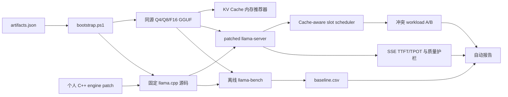

# Cache-aware llama.cpp 推理实验台

这是一个面向推免面试的可复现 AI Infra 项目。项目不只调用上游二进制：它直接修改 `llama-server` 的 C++ slot 调度和 metrics 数据路径，实现 eviction-cost-aware KV Cache 调度，再用可控冲突 workload 与上游策略做 A/B。量化、CUDA/CPU、TTFT/TPOT 和质量实验作为完整验证底座。

个人核心贡献集中在 [engine patch](patches/0001-cache-aware-slot-scheduler.patch)：新增独立 C++ 调度模块、CLI 参数、原生测试，以及 KV/内存/缓存复用指标。完整上游源码继续放在 `vendor/`，个人 patch 单独提交，避免用第三方代码体量冒充本人工作。

## 当前复现结果

环境：Windows 11、RTX 4050 Laptop 6GB、Intel i5-13500H、llama.cpp `b9632`、Qwen2.5-0.5B-Instruct GGUF 固定 revision。

- Q4_K_M 权重约为 F16 的 38.5%，实测峰值显存为 625 MiB（Q8 753 MiB、F16 1241 MiB），CUDA decode 速度约为 F16 的 1.97 倍。
- Q4 CUDA decode 速度约为 12 线程 CPU-only 的 4.66 倍。
- 并发从 1 增至 4 时，聚合输出吞吐约提高至 2.37 倍，但单请求 TPOT 和尾延迟变差。
- 在 5 次 cache-conflict A/B 中，新调度减少 91.6% 的重复 prefill、减少 97.5% 的缓存淘汰，使两请求序列中位延迟从 1372.28 ms 降至 138.85 ms（9.88 倍）。
- 0.5B 模型在简单专业题上仍会产生事实错误；量化性能提升不能替代质量评测。

完整数值见 [results/report.md](results/report.md)。结果只代表固定环境，不能直接外推到其他模型和硬件。

## 系统结构



## 一键复现

项目首次初始化约下载 3GB 模型和 650MB Windows CUDA 运行包。构建 patched server 需要 Visual Studio 2022 C++ workload 和 CMake。所有制品都固定 URL、revision、大小和 SHA-256；bootstrap 会把个人 patch 幂等应用到固定上游提交。

```powershell
cd D:\llama
powershell -ExecutionPolicy Bypass -File .\scripts\bootstrap.ps1
powershell -ExecutionPolicy Bypass -File .\scripts\verify.ps1 -Full
```

`-Full` 将依次运行：

1. Python 单元测试与语法编译；
2. 编译 patched C++ server 并运行原生调度测试；
3. 运行上游策略/新策略的 KV Cache 冲突 A/B；
4. 制品 SHA-256、Q4/Q8/F16 和 CPU/GPU benchmark；
5. 并发 1/2/4 在线测试与质量护栏；
6. 自动生成 Markdown 报告。

只验证环境和测试：

```powershell
.\scripts\verify.ps1
```

## 分步运行

```powershell
powershell -ExecutionPolicy Bypass -File .\scripts\build_patched_server.ps1
python .\scripts\run_engine_ab.py
python .\scripts\run_benchmarks.py
python .\scripts\run_server_benchmark.py
python .\scripts\run_quality.py
python .\scripts\generate_report.py
```

显存预算建议器示例：

```powershell
python .\scripts\memory_advisor.py `
  --model .\models\qwen2.5-0.5b-instruct-q4_k_m.gguf `
  --available-mib 5075 `
  --slots 4
```

## 实验设计

### C++ Cache-aware slot 调度

上游策略在空闲 slot 中选择与新 prompt 最相似的缓存。它只最大化当前请求复用，可能为了多复用少量 token 而破坏一个长会话。新增策略使用：

```text
score = reusable_prefix_tokens - eviction_penalty × discarded_cached_tokens
```

`--slot-cache-eviction-penalty 0` 严格保留最长公共前缀行为；正值考虑缓存机会成本，得分非正时回退 LRU。相同得分使用 LRU 打破平局。纯函数调度模块有原生 C++ 边界测试，metrics 同时暴露选择次数、估计复用/淘汰 token、KV 占用和 llama.cpp 内部分配内存。

`config/engine_ab.json` 固定两个 slot：一个保存 480-token 长会话，一个保存 70-token 短会话。冲突请求在“当前多复用 20 token”和“保护 400 token 长缓存”之间选择，随后立即访问长会话，从而测量整个序列而非只挑单请求指标。

### 离线吞吐

`config/experiment.json` 固定 prompt 256 tokens、generation 64 tokens 和三次重复。GPU 比较 Q4_K_M/Q8_0/F16；CPU-only 比较 6/12 线程。`pp` 是 prompt processing，`tg` 是 token generation。官方 `llama-bench` 不含 tokenization 和 sampling 时间，因此不能用它代替在线延迟。

### 在线流式指标

`config/server_benchmark.json` 启动四个服务 slot，分别施加并发 1/2/4 的固定请求，每档至少 30 个样本。脚本从 SSE 第一个非空 content 事件计算 TTFT（首 token 的接口近似），并以首 token 后的生成 token 计算 TPOT；聚合 TPS 使用整组完成 token 数除以墙钟时间。

### 质量护栏

`config/quality.json` 使用固定温度 0、固定任务和正/负规则。它能发现显然错误，但只有五题，不能代替 perplexity、标准评测集或人工事实核验。每条完整输出保存在 `quality_results.csv`，不能只汇报通过率。

### 内存估算

对 decoder-only Transformer，F16 KV Cache 近似为：

```text
2 × layers × kv_heads × head_dim × context × slots × 2 bytes
```

推荐器再加 GGUF 文件大小、固定 runtime 预留和 15% 安全余量。它是容量规划估算；基准脚本同时轮询 `nvidia-smi` 给出整卡基线、峰值和增量，但最终的精细归因仍应使用 NVML 或 profiler 验证。

Windows 预编译包即使使用 `-ngl 0` 也会加载 CUDA backend 并创建上下文，因此 CPU-only case 可能显示数百 MiB 的 CUDA 运行时占用；`execution=CPU-only` 表示模型层未 offload，不表示进程完全不初始化 CUDA。

## 目录

```text
config/       固定制品、离线、在线和质量配置
patches/      可审查、可重放的个人 llama.cpp C++ 改动
docs/         架构与面试追问
models/       下载的 GGUF，Git 忽略
runtime/      官方预编译运行包，Git 忽略
scripts/      初始化、实验、报告和验证入口
src/          指标、SSE、benchmark、质量和推荐器实现
tests/        无外部依赖的单元测试
results/      可提交的汇总结果；raw 日志被忽略
vendor/       固定版本 llama.cpp 源码，Git 忽略
build/        本机构建的 patched server，Git 忽略
```

## 面试演示建议

三分钟演示顺序：先展示独立 C++ 调度函数和原生测试，再用日志解释惩罚 0 为什么淘汰 400 token、惩罚 0.5 为什么只淘汰 10 token，随后展示 5 次 A/B 的累计延迟与 prefill 差异。最后再用 CUDA/量化数据说明实验底座如何验证改动。应表述为“修改 llama.cpp slot 调度与可观测性”，而不是“实现了整个 llama.cpp”。

进一步追问与回答框架见 [docs/interview-notes.md](docs/interview-notes.md)。

## 来源与许可证

- [llama.cpp](https://github.com/ggml-org/llama.cpp)：MIT；本项目固定 `b9632/acd79d603cb2e1c84c0886137b80f1ad649b6857`。
- [Qwen2.5-0.5B-Instruct-GGUF](https://huggingface.co/Qwen/Qwen2.5-0.5B-Instruct-GGUF)：Apache-2.0；固定 revision `9217f5db79a29953eb74d5343926648285ec7e67`。
- 第三方源码、二进制和模型不进入本仓库提交；各自许可证独立生效。
