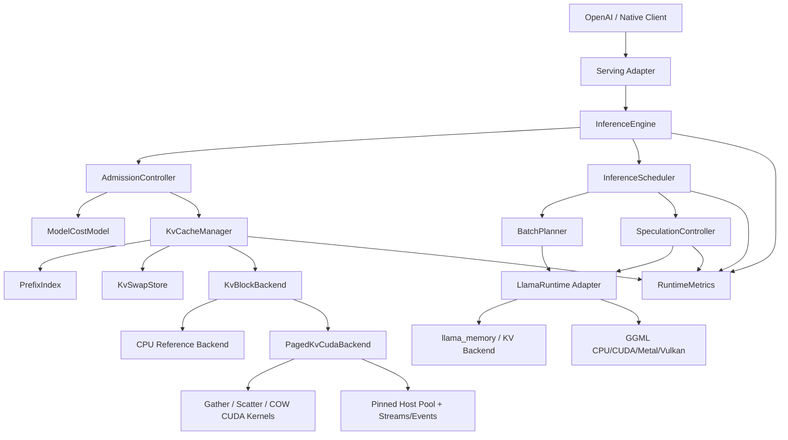
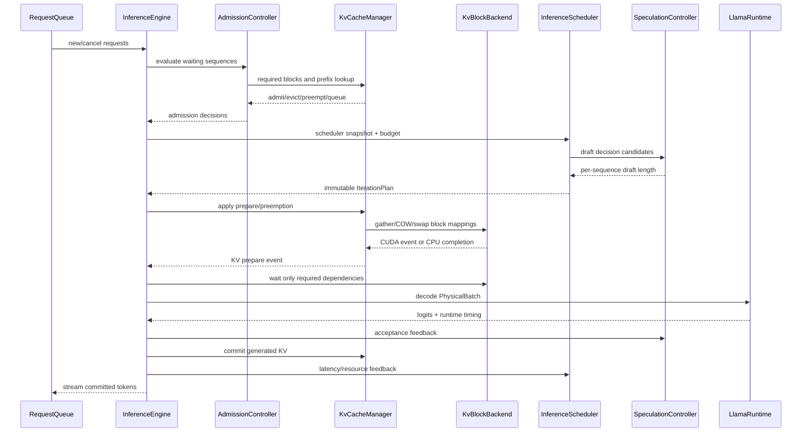

# CacheFlow Runtime 整体架构设计

状态：Implementation in progress；自动化测试通过不等于本设计全部验收通过
目标仓库：`D:\llama`  
上游基线：llama.cpp `acd79d603cb2e1c84c0886137b80f1ad649b6857`  
主实现语言：C++17；Python 仅用于实验编排和结果分析

## 1. 文档目的

本项目不是在 llama.cpp 外增加一层 HTTP 包装，也不是为了代码行数机械重写整个上游仓库。目标是在保持 GGUF、模型实现和硬件 Backend 可用的前提下，重构推理运行时的核心热路径，并形成一个能够独立解释、测试和验证的 LLM Serving Runtime。

项目最终回答一个明确的问题：

> 在显存和 KV Cache 容量有限的单机环境中，如何联合优化 Prefix 复用、Continuous Batching、Chunked Prefill、抢占恢复和 Speculative Decoding，使吞吐、TTFT、TPOT 与尾延迟取得可解释的平衡？

本文冻结后续重构的模块划分、Interface、状态所有权、迁移顺序和验收标准。没有在本文中定义的外围功能，不得优先于推理热路径实施。

## 2. 项目定位

项目名称：**CacheFlow Runtime**

一句话定位：

> 基于 llama.cpp fork 重构的缓存感知 LLM 推理运行时，贯通 Serving Scheduler、KV Runtime 与 CUDA KV Backend，核心实现 Token-level Continuous Batching、Paged Prefix KV、资源抢占和自适应 Speculative Decoding。

项目必须形成三层可演示的个人实现：

1. **Serving 层**：Token-level Scheduler、Admission、Preemption 和 SLO；
2. **Runtime 层**：Block Table、Prefix Sharing、COW、Swap 和 Speculation；
3. **GPU Backend 层**：CUDA KV Gather/Scatter/COW Kernel、Pinned Memory、Stream 和 Event。

只有前两层而没有 CUDA 时，项目仍属于 LLM Serving Infra，但不满足本项目最终面向“高性能推理引擎”的完整验收标准。

项目面向：

- LLM Serving / AI Infra 面试；
- C++ 推理引擎与系统优化面试；
- 模型部署、量化和性能工程面试；
- 可复现的个人系统项目展示。

## 3. 核心原则

### 3.1 推理热路径优先

个人核心工作必须进入以下真实调用链：

```text
Request
  -> tokenize / template
  -> admission
  -> KV prepare
  -> schedule iteration
  -> build llama_batch
  -> llama_decode
  -> sample / verify draft
  -> update KV and runtime state
  -> stream result
```

HTTP、配置、日志和脚本是必要配套，但不计为主要 AI Infra 创新。

### 3.2 深模块与小 Interface

每个核心 Module 必须隐藏复杂状态和算法，调用者只学习少量 Interface。测试与生产调用通过同一个 Seam，不为测试暴露内部数据结构。

### 3.3 默认兼容，策略可切换

- 默认配置必须保持上游语义和输出正确性；
- 每项新策略都必须能单独开关；
- A/B 必须使用同一模型、同一请求轨迹和同一硬件；
- 负结果必须保留，不得只报告有利样本。

### 3.4 第三方代码不冒充个人贡献

- GGML 通用算子、既有 CUDA/Metal/Vulkan Backend、GGUF 基础格式和模型定义保留上游来源；
- 项目必须新增一个自研 CUDA KV Block Backend，而不是只调用上游 CUDA 二进制；
- 重构后的运行时、调度、KV 策略、CUDA KV Kernel、控制算法、测试和实验属于个人贡献；
- Patch、Git commit 和代码统计分别报告继承、修改和新增代码。

## 4. 范围与非目标

### 4.1 本期必须覆盖

- 推理请求和 Sequence 状态所有权重构；
- Token-level Continuous Batching；
- Decode 优先与 Chunked Prefill；
- KV Block Table 与容量账本；
- Prefix Block 共享和 Copy-on-Write；
- KV 成本感知淘汰；
- 请求抢占、换出和恢复；
- CUDA KV Block Gather/Scatter 与 Copy-on-Write Kernel；
- CUDA Stream、Event 和 Pinned Host Memory 驱动的异步 KV Swap；
- CPU Reference 与 CUDA Backend 的逐元素正确性对照；
- 自适应 Speculative Decoding；
- 模型结构、量化、KV 和性能成本建模；
- TTFT、TPOT、吞吐、P95/P99、KV 利用率等原生指标；
- 真实模型端到端 A/B 和故障注入。

### 4.2 明确非目标

- 从零重写全部 CUDA、Metal、Vulkan、BLAS 算子；本项目只自研与 Paged KV 主线直接相关的 CUDA Kernel；
- 自研通用量化 GEMM、FlashAttention 或完整 CUDA Graph Compiler；这些可作为后续扩展，但不能替代本期 KV CUDA Backend；
- 从零重写所有已支持模型的 Graph 定义；
- 自创 GGUF 文件格式；
- 分布式训练；
- 多机 Tensor Parallel 作为第一阶段目标；
- 用 Python 模拟结果代替真实 C++ 热路径验证。

## 5. 代码所有权与仓库策略

当前存在两个 Git 层级：

```text
D:\llama                         实验、配置、报告和可重放 patch
D:\llama\vendor\llama.cpp       实际 C++ fork，保留上游历史
```

最终交付遵循以下规则：

1. `vendor/llama.cpp` 的 `codex/cacheflow-runtime` 分支是 C++ 主实现；
2. 外层仓库保存固定上游 revision、可重放 patch、模型清单、实验和报告；
3. 个人 C++ commit 必须保持可二分，每个 commit 都可构建和测试；
4. Python `prototypes/cacheflow` 是已归档的早期控制面原型，不作为最终运行时核心；
5. 原型测试只用于保存设计演进证据；production server 不把 `prototypes/` 加入导入或调用链。

## 6. 目标架构



### 6.1 目标目录

重构采用渐进迁移，目标逻辑目录如下；在迁移完成前可暂时位于 `tools/server`，但 Interface 和依赖方向必须与目标一致。

```text
runtime/
  inference-engine.*
  llama-runtime-adapter.*
  runtime-state.*

scheduler/
  inference-scheduler.*
  batch-planner.*
  admission-controller.*
  preemption-policy.*

memory/
  kv-cache-manager.*
  kv-block-table.*
  prefix-index.*
  kv-eviction-policy.*
  kv-swap-store.*

speculation/
  speculation-controller.*
  acceptance-model.*

model/
  model-profile.*
  model-cost-model.*

serving/
  request-adapter.*
  stream-writer.*
  runtime-metrics.*

backends/
  llama-runtime-adapter.*
  kv-block-backend.*
  kv-block-cpu.*
  paged-kv-cuda.h
  paged-kv-cuda.cu
  cuda-pinned-pool.*

tests/
benchmarks/
```

## 7. 核心领域对象

### 7.1 Request 与 Sequence 分离

`Request` 表示外部调用；`Sequence` 表示一次可调度的模型生成序列。一个 Request 可以产生多个 Sequence，例如 `n > 1`、Beam 或父子共享 Prompt。

```cpp
enum class SequencePhase {
    WAITING,
    PREFILL,
    DECODE,
    PREEMPTED,
    SWAPPED,
    FINISHED,
    FAILED,
};

struct SequenceState {
    SequenceId id;
    RequestId request_id;
    SequencePhase phase;
    uint32_t prompt_cursor;
    uint32_t generated_tokens;
    uint32_t reserved_decode_tokens;
    uint64_t arrival_us;
    uint64_t deadline_us;
    BlockTable block_table;
    SamplingState sampling;
};
```

状态迁移：

```text
WAITING -> PREFILL -> DECODE -> FINISHED
              |          |
              +-> PREEMPTED <-+
                       |
                       +-> SWAPPED -> PREFILL/DECODE

任意非终态 -> FAILED
```

不变量：

- 只有 `InferenceEngine` 修改 Sequence Phase；
- `InferenceScheduler` 返回计划，不直接修改 Sequence；
- `KvCacheManager` 拥有 Block Table，Sequence 只持稳定句柄；
- Runtime Adapter 不拥有请求生命周期。

### 7.2 IterationPlan

每次 `llama_decode()` 前生成一个不可变计划：

```cpp
struct IterationPlan {
    std::vector<DecodeItem> decode;
    std::vector<PrefillChunk> prefill;
    std::vector<Preemption> preemptions;
    std::vector<Restore> restores;
    std::vector<SpeculationPlan> speculation;
    uint32_t token_budget;
    uint32_t kv_blocks_required;
};
```

计划生成后到执行完成前不得改变；取消请求在下一迭代生效，避免 Batch 与状态不一致。

## 8. Module 设计

### 8.1 InferenceEngine

职责：统一拥有请求生命周期和一次推理迭代的事务边界。

Interface：

```cpp
class InferenceEngine {
public:
    SubmitResult submit(Request request);
    bool cancel(RequestId id);
    IterationResult step();
    EngineSnapshot snapshot() const;
};
```

`step()` 内部顺序固定：

1. 接收新请求与取消；
2. Admission；
3. 生成 KV PreparePlan；
4. Scheduler 生成 IterationPlan；
5. 应用抢占、恢复和 Block Table 变更；
6. Runtime 构造并执行 Batch；
7. Sampling / Draft Verification；
8. 提交状态与 Metrics；
9. 发布流式结果。

失败原则：执行失败时只提交已确认完成的 Token；未提交计划必须回滚或重新计算。

### 8.2 InferenceScheduler

职责：在 Token、时间和 KV 预算下决定本轮运行哪些 Sequence。

Interface：

```cpp
class InferenceScheduler {
public:
    IterationPlan plan(const SchedulerSnapshot &, const ResourceBudget &);
    void observe(const IterationFeedback &);
};
```

调度优先级：

1. 已处于 Decode 的延迟敏感 Sequence；
2. 距离 Deadline 最近的请求；
3. 等待超过阈值的 Prefill；
4. 高 Prefix 命中、低 Prefill 成本请求；
5. 普通 FCFS 请求。

请求级评分：

```text
priority =
    deadline_bonus
  + waiting_age_weight * waiting_ms
  + prefix_reuse_tokens * predicted_prefill_cost
  - kv_blocks_required * kv_pressure_price
  - preemption_risk
```

Slot 选择评分：

```text
slot_score =
    reusable_prefix_tokens * prefill_cost_per_token
  - evicted_tokens * future_reuse_probability * prefill_cost_per_token
  - restore_cost
```

当前 `server-inference-scheduler.*` 是此 Module 的第一阶段实现。

### 8.3 BatchPlanner

职责：将已选 Sequence 转换为一次物理 `llama_batch`，处理 Decode、Prefill 和 Draft Verification 的 Token 布局。

核心规则：

- Decode 首先占用预算；
- Speculative Verification 与普通 Decode 共享 Decode 预算；
- 剩余预算用于 Chunked Prefill；
- 单个长 Prompt 不得耗尽所有 Prefill 预算；
- LoRA、Embedding、Multimodal 等不兼容请求不得错误合批；
- 每个 active Sequence 至少产生正确的 logits 位置。

Chunk 大小不采用全局固定常数。控制目标为：

```text
minimize:
    decode_stall_ms
  + prefill_kernel_overhead_ms
  + fairness_penalty
```

控制器候选动作：`{0/upstream, 64, 128, 256, 512}`。根据 Backend、模型、并发和最近迭代耗时选择。当前 CPU 实验已证明固定 32/128/256 并不自动优于上游，因此自适应是必须项。

### 8.4 KvCacheManager

职责：拥有逻辑 KV Block、物理页映射、Prefix 共享、容量准入和淘汰。

Interface：

```cpp
class KvCacheManager {
public:
    KvPreparePlan prepare(const SequenceSnapshot &, uint32_t reserve_tokens);
    void commit(const KvPreparePlan &, const DecodeResult &);
    void release(SequenceId);
    KvSnapshot snapshot() const;
};
```

核心数据结构：

```cpp
struct KvBlock {
    BlockId id;
    uint32_t token_count;
    uint32_t ref_count;
    uint64_t content_hash;
    uint64_t last_access_us;
    BlockLocation location; // DEVICE, HOST, DISK
};

struct BlockTable {
    SequenceId sequence;
    std::vector<BlockId> blocks;
    uint32_t tail_tokens;
};
```

Block Size 初始默认 16 Token，可配置并通过实验比较。

### Prefix 共享

1. Token 序列按完整 Block 计算增量 Hash；
2. `PrefixIndex` 查找最长完整 Block Prefix；
3. 命中 Block 增加引用计数；
4. 不完整尾 Block 不跨 Sequence 共享；
5. 任一共享 Block 被修改时执行 Copy-on-Write；
6. 只有 `ref_count == 0` 的 Block 才能物理回收。

### 容量准入

```text
required_blocks =
    uncached_prompt_blocks
  + reserved_decode_blocks
  + speculative_extra_blocks
```

准入结果只能是：

- `ADMIT`：容量足够；
- `EVICT_AND_ADMIT`：淘汰空闲 Prefix 后足够；
- `PREEMPT_AND_ADMIT`：需要抢占低优先级活跃序列；
- `QUEUE`：暂不准入；
- `REJECT`：请求本身超过模型或物理限制。

### 淘汰价值

```text
eviction_cost =
    reuse_probability * recompute_prefill_ms
  + swap_restore_ms
  + shared_reference_penalty
  + deadline_penalty
```

不能只用 LRU；LRU 仅作为信息不足时的兼容策略。

### 与 llama.cpp Memory 的迁移

第一阶段使用 `llama_memory_seq_*` 作为 Adapter，建立逻辑 Block Table 和指标；第二阶段在以下实现中增加稳定 Block 操作：

- `src/llama-memory.*`
- `src/llama-kv-cache.*`
- `src/llama-kv-cells.h`
- Hybrid / Recurrent Memory 对应实现

Paged KV 优化仅对支持随机 Sequence Remove/Copy 的 Attention KV Backend 开启；Recurrent、SWA 和 Hybrid Memory 必须通过能力查询降级，不得假设所有模型均可分页。

### 8.5 PrefixIndex

职责：从 Token Block Prefix 映射到共享 KV Block Chain。

可选实现对比：

- Radix Tree：支持最长前缀和自然共享；
- Hash Chain：实现简单，按 Block 查询；
- Radix + Block Hash：目标实现。

Interface：

```cpp
class PrefixIndex {
public:
    PrefixMatch match(TokenSpan tokens) const;
    PrefixHandle insert(TokenSpan tokens, BlockSpan blocks);
    void erase(PrefixHandle);
};
```

复杂度目标：查询 `O(number_of_prompt_blocks)`，不得逐 Slot 重复比较全部 Token。

### 8.6 PreemptionPolicy 与 KvSwapStore

抢占粒度为 Sequence，不在任意 Token 中间破坏状态。

优先策略：

1. 淘汰无人引用的 idle Prefix；
2. 换出低复用概率的 idle Sequence；
3. 抢占低优先级 Prefill；
4. 最后才抢占正在 Decode 的 Sequence。

`KvSwapStore` 提供两个 Adapter：

- In-memory Host Store：测试与高速恢复；
- File Store：容量扩展与故障注入。

Interface：

```cpp
class KvSwapStore {
public:
    SwapHandle save(SequenceId, const BlockTable &);
    RestoreResult restore(SwapHandle, MutableBlockTable &);
    void erase(SwapHandle);
};
```

保存失败必须退化为重计算，不得导致其他 Sequence 状态损坏。

### 8.7 SpeculationController

职责：决定是否推测以及本轮 Draft 长度，不负责生成 Draft Token。

Interface：

```cpp
class SpeculationController {
public:
    SpeculationPlan choose(const SequenceSnapshot &, const RuntimeSnapshot &);
    void observe(const SpeculationFeedback &);
};
```

输入：

- 每个 Sequence 的 EWMA 接受率；
- Draft 与 Target 每 Token 耗时；
- 当前 Batch 并发；
- KV Block 压力；
- 剩余输出 Token；
- Context 剩余空间。

收益估算：

```text
expected_gain_ms =
    expected_accepted_tokens * target_decode_ms
  - draft_generation_ms
  - target_verification_overhead_ms
  - kv_pressure_price * extra_blocks
```

仅当 `expected_gain_ms > hysteresis_margin` 时启用，避免在阈值附近频繁开关。

控制动作：`draft_length in [0, configured_max]`。低接受率、KV 高压或高并发时缩短；高接受率且 Decode 成为瓶颈时增大。

### 8.8 ModelCostModel

职责：把模型结构和在线观测转换为调度可使用的成本。

静态输入：

- Layer、Attention Head、KV Head、Head Dimension；
- Context Limit；
- KV 数据类型；
- 权重量化类型和大小；
- Backend 类型。

KV 理论成本：

```text
KV bytes =
    2 * layers * kv_heads * head_dim
      * sequence_tokens * bytes_per_element
```

动态模型按 `(model, backend, context_bucket, concurrency_bucket)` 保存 EWMA：

- Prefill ms/token；
- Decode ms/token；
- Draft ms/token；
- Verification ms/token；
- Swap save/restore 带宽。

成本模型只提供估算与置信度；Scheduler 决定策略。

### 8.9 LlamaRuntime Adapter

职责：隔离上层运行时与 llama.cpp 低层 Context/Batch/Memory 调用。

Interface：

```cpp
class LlamaRuntime {
public:
    RuntimeCapabilities capabilities() const;
    DecodeResult decode(const PhysicalBatch &);
    void remove_kv(SequenceId, PositionRange);
    void copy_kv(SequenceId from, SequenceId to, PositionRange);
    MemorySnapshot memory_snapshot() const;
};
```

必须存在两个 Adapter 才建立真实 Seam：

- 生产 `LlamaCppRuntime`；
- 测试 `DeterministicRuntime`，可注入 OOM、延迟和部分失败。

### 8.10 KvBlockBackend 与 PagedKvCudaBackend

职责：执行 KV Block 的物理复制、聚集、分散、Copy-on-Write 和 Device/Host Swap。`KvCacheManager` 决定移动什么以及为什么移动，Backend 只负责按照不可变映射高效执行。

该 Module 是本期必做的 GPU 实现，不属于可选加分项。CPU Reference Adapter 用于正确性测试；CUDA Adapter 用于真实 RTX 4050 性能验证。

Interface：

```cpp
struct KvTensorLayout {
    uint32_t layers;
    uint32_t kv_heads;
    uint32_t head_dim;
    uint32_t block_tokens;
    KvElementType element_type;
    KvMemoryLayout memory_layout;
};

struct BlockCopy {
    PhysicalBlockId source;
    PhysicalBlockId destination;
};

class KvBlockBackend {
public:
    virtual BackendEvent copy_blocks(
        Span<const BlockCopy> mapping,
        const KvTensorLayout &) = 0;

    virtual BackendEvent swap_out(
        Span<const PhysicalBlockId> blocks,
        MutableHostBlockSpan destination) = 0;

    virtual BackendEvent swap_in(
        HostBlockSpan source,
        Span<const PhysicalBlockId> destinations) = 0;

    virtual void wait(BackendEvent) = 0;
};
```

CUDA Kernel 至少覆盖：

```cpp
template <typename scalar_t>
__global__ void gather_kv_blocks(
    const scalar_t * src_k,
    const scalar_t * src_v,
    scalar_t * dst_k,
    scalar_t * dst_v,
    const BlockCopy * mapping,
    KvTensorLayout layout);

template <typename scalar_t>
__global__ void scatter_kv_blocks(...);

template <typename scalar_t>
__global__ void clone_shared_tail_block(...); // Copy-on-Write
```

实现要求：

- 支持 FP16，并为当前 llama.cpp KV 类型保留模板扩展点；
- 一个 Kernel Launch 处理一组非连续 Block Mapping，避免每个 Block 单独发起 `cudaMemcpyAsync`；
- K/V 可采用同一 Grid 中的独立 Plane，具体布局由 `KvTensorLayout` 描述，不在 Kernel 中写死模型结构；
- Device-to-Host 使用 Pinned Memory Pool；
- Copy、Swap Out、Swap In 使用独立 CUDA Stream，并用 Event 向 Engine 暴露依赖；
- 禁止在调度主线程调用全局 `cudaDeviceSynchronize()`；
- BackendEvent 完成前，源 Block 和目标 Block 都不得被回收或重新分配；
- CUDA 错误必须转换为 Runtime Error，触发重计算或请求失败，不得留下半提交 Block Table；
- CPU Reference 与 CUDA 输出逐元素相同；
- 不支持 CUDA 的构建继续使用 CPU Adapter，功能正确但不宣称 GPU 性能收益。

性能目标不是击败单次大块连续 `cudaMemcpyAsync`，而是在真实的非连续 Block Mapping、Prefix COW 和多 Block Swap 场景中，减少 Launch 数、同步次数和尾延迟。

CUDA 子系统的依赖方向固定为：

```text
KvCacheManager
    -> KvBlockBackend Interface
        -> CpuKvBlockBackend
        -> PagedKvCudaBackend
            -> CUDA Runtime / GGML CUDA allocation Adapter
```

`PagedKvCudaBackend` 不得反向依赖 Scheduler、HTTP 或 Request 类型。

## 9. 一次推理迭代的数据流



## 10. 并发与一致性模型

- 一个 Engine Loop 线程拥有调度状态和 Sequence 状态；
- HTTP/网络线程只投递 Command，不直接修改 Slot/KV；
- Backend Decode 可异步，但计划提交由 Engine Loop 串行完成；
- Metrics 使用快照或原子计数，不持有 Engine 主锁执行 I/O；
- Swap I/O 通过工作线程完成，Sequence 保持 `SWAPPED/PREEMPTED`；
- CUDA Block 操作异步提交，Engine 只等待当前 Decode 真正依赖的 Event；
- Pinned Buffer 和 Device Block 的生命周期延长到对应 CUDA Event 完成；
- 同一 Sequence 同时最多存在一个未提交 IterationPlan。

必须保持：

- Block 引用计数不为负；
- Free Block 不得出现在任何 Block Table；
- 每个物理 KV Position 最多归属允许共享的 Sequence 集合；
- 输出 Token 只有在 Target 验证并提交后才能发送；
- 取消不回收仍被正在执行 Batch 引用的 KV；
- 失败回滚后 Scheduler Snapshot 与 Runtime Snapshot 一致。
- CUDA 操作失败时不得提交部分 Block Mapping；旧 Block Table 保持可重算。

## 11. 配置设计

配置分为兼容参数与实验策略参数。

```text
--scheduler-policy upstream|cacheflow
--slot-cache-eviction-penalty FLOAT
--prefill-policy greedy|fixed|adaptive
--prefill-chunk-size N
--prefill-token-budget N
--kv-block-size N
--kv-admission-reserve-tokens N
--kv-eviction-policy lru|cost
--kv-swap-path PATH
--kv-swap-budget-mib N
--kv-block-backend cpu|cuda
--kv-cuda-copy-streams N
--kv-pinned-pool-mib N
--spec-policy fixed|adaptive
--spec-target-acceptance FLOAT
--spec-ewma-alpha FLOAT
```

规则：

- `upstream` 必须关闭全部行为变化；
- 非法组合在启动时失败，不在运行中静默忽略；
- Metrics 必须导出最终生效配置；
- 实验文件固定所有策略参数。

## 12. 可观测性

### 12.1 请求指标

- `time_to_first_token_seconds`
- `time_per_output_token_seconds`
- `request_latency_seconds`
- `request_queue_seconds`
- `requests_preempted_total`
- `requests_swapped_total`
- `requests_recomputed_total`

### 12.2 Scheduler 指标

- `scheduler_iterations_total`
- `decode_tokens_scheduled_total`
- `prefill_tokens_scheduled_total`
- `prefill_chunks_scheduled_total`
- `batch_tokens`
- `batch_sequences`
- `prefill_starvation_ms`

### 12.3 KV 指标

- `kv_blocks_used`
- `kv_blocks_free`
- `kv_prefix_hit_ratio`
- `kv_shared_blocks`
- `kv_copy_on_write_total`
- `kv_evicted_blocks_total`
- `kv_swap_bytes_total`
- `kv_restore_seconds`
- `kv_admission_failures_total`

### 12.4 Speculation 指标

- `draft_tokens_total`
- `draft_tokens_accepted_total`
- `draft_acceptance_ratio`
- `adaptive_draft_length`
- `speculation_disabled_total{reason}`
- `speculation_net_saved_ms`

### 12.5 CUDA KV Backend 指标

- `cuda_kv_kernel_launches_total`
- `cuda_kv_blocks_copied_total`
- `cuda_kv_copy_bytes_total`
- `cuda_kv_copy_seconds`
- `cuda_kv_swap_out_seconds`
- `cuda_kv_swap_in_seconds`
- `cuda_kv_effective_bandwidth_bytes`
- `cuda_kv_events_waited_total`
- `cuda_kv_pinned_pool_bytes`
- `cuda_kv_backend_errors_total`

指标必须区分累计值、当前 Gauge 和 Histogram；不得把所有 Prometheus 样本都标记成 Gauge。

## 13. 测试策略

### 13.1 纯模块测试

- Scheduler：预算、公平性、Deadline、默认兼容；
- Block Table：分配、释放、引用计数、COW；
- PrefixIndex：最长匹配、删除、Hash 冲突保护；
- Admission：容量边界、Victim 选择、不可准入；
- Speculation：EWMA、迟滞、压力降级；
- CostModel：KV 公式和 Bucket 更新。

### 13.2 状态机/属性测试

随机生成请求、取消、抢占和恢复序列，持续检查：

- Block 总量守恒；
- 无悬空引用；
- 已完成请求不会再次调度；
- 相同 Seed 输出确定；
- 上游模式行为一致。

### 13.3 Runtime 集成测试

使用 `DeterministicRuntime`：

- 注入固定 Decode 延迟；
- 注入 KV OOM；
- 注入 Swap 保存/恢复失败；
- 注入 Draft 低接受率；
- 验证 Engine 的回滚和降级。

### 13.4 真实模型测试

至少覆盖：

- Qwen2.5-0.5B Q4/Q8/F16；
- CPU 与 CUDA；
- 单请求与 2/4/8 并发；
- 128/512/2K/长 Context；
- 多轮对话与共享 System Prompt；
- 混合短 Decode、长 Prefill 负载。

### 13.5 CUDA Kernel 测试

- CPU Reference 与 CUDA Gather/Scatter/COW 逐元素对照；
- FP16 K/V、不同 Layer/KV Head/Head Dim；
- Block Size 8/16/32/64；
- 连续、随机、重复和重叠映射；
- 非 Block 整除尾部；
- In-place COW 禁止覆盖共享源；
- 多 Stream Event 依赖；
- Pinned Pool 耗尽与 CUDA OOM；
- Compute Sanitizer 或等效越界检查；
- CUDA 不可用时构建和 CPU 降级路径。

## 14. Benchmark 设计

所有实验至少三次 fresh-process trial，报告 Median、P95 和原始数据。

| 实验 | Baseline | Variant | 主要指标 |
|---|---|---|---|
| Slot 选择 | LCP/LRU | Cost-aware | 重复 Prefill、淘汰 Token、序列延迟 |
| Prefix Cache | Slot Cache | Block Prefix | Hit Ratio、共享 Block、显存 |
| Prefill | Greedy | Fixed/Adaptive Chunk | TTFT、Decode TPOT、Prefill TPS |
| Batching | FCFS | Token-level | Throughput、P95、Fairness |
| KV 压力 | 被动失败清理 | Admission/Preemption | OOM、抢占、恢复时间 |
| Speculation | Fixed Draft | Adaptive Draft | 接受率、TPS、额外 KV、净收益 |
| Swap | Recompute | Host/Disk Restore | 恢复延迟、总吞吐 |
| CUDA Block Copy | per-block `cudaMemcpyAsync` | batched Gather/Scatter Kernel | Launch 数、带宽、P50/P95 |
| CUDA COW | 整 Sequence 复制 | Tail Block COW Kernel | 复制字节、延迟、显存峰值 |
| CUDA Swap | Pageable/同步 | Pinned/Stream/Event | Swap 延迟、Decode Stall、有效带宽 |

负结果策略：

- 保留所有参数点；
- 解释机制，不只报百分比；
- 若 CPU 与 GPU 结论相反，分别建模；
- 不用单个对抗样本宣称生产平均收益。

## 15. 迁移路线

每一阶段都必须保持 `llama-server` 可构建、可运行；采用替换旧逻辑，而不是在旧逻辑外重复叠层。

### Phase 0：基线与可复现性——已完成

- 固定 llama.cpp commit、模型 revision 和 SHA-256；
- 固定 Q4/Q8/F16 与 CPU/CUDA benchmark；
- 建立真实请求指标与质量护栏。

### Phase 1：Scheduler Seam——已完成

- 从 `server-context.cpp` 提取 `InferenceScheduler`；
- Slot 选择和 Prefill Budget 通过同一 Interface；
- 默认模式保持上游行为；
- 原生 C++ 测试覆盖公平性与兼容。

### Phase 2：KV 资源模型——已完成

- 逻辑容量规划与 Value-aware Victim；
- Block Table、PrefixIndex、引用计数与 Reservation；
- 统一 KV Memory Capability 和生产 Runtime Adapter；
- decode 失败通过 iteration abort 回滚，不依赖临时清理。

### Phase 3：Engine Loop 拆分——已完成

- 将 `update_slots()` 拆为 prepare、plan、execute、commit；
- `server_inference_engine` 统一拥有 Scheduler、Capacity Planner、Speculation、KV Runtime、Swap Store、Runtime Adapter 和 iteration transaction；
- Engine 的 `step()` 固定 prepare -> plan/execute -> commit 顺序，`server_context` 只能通过 callback 适配协议与 llama 对象，不能重排事务阶段；
- `server_context` 降为组合根、协议适配和 execute callback；
- 生产与 `DeterministicRuntime` 测试走同一个 Engine Seam；
- sequence phase 只能通过 Engine 的合法状态迁移更新。

### Phase 4：Paged Prefix KV——已完成

- 实现 Block 分配、完整/部分 Tail Block 共享、自动 COW 和回收；
- Attention KV Backend 通过 `llama_memory_cacheflow_*` 物理接入真实 K/V Tensor；
- 不支持 block capability 的 Hybrid/Recurrent Memory 明确返回 false 并回退上游路径；
- CPU/CUDA Prefix A/B 和随机容量守恒测试。

### Phase 5：CUDA KV Block Backend——已完成

- 建立 `KvBlockBackend` Interface 和 CPU Reference；
- 实现 FP16 Gather/Scatter/COW CUDA Kernel；
- 实现 Pinned Host Pool、Copy/Swap Stream 和 Event；
- 接入 GGML CUDA 分配与 llama KV 物理布局；
- 与 per-block `cudaMemcpyAsync` 做 Microbenchmark；
- 在 RTX 4050 上完成真实 Prefix COW 和 Swap A/B；
- 当前代码已进入真实 CUDA `llama-server` 路径；最终 `verify.ps1 -Full` 的 memcheck/racecheck 和端到端 smoke 均通过。

### Phase 6：Preemption 与 Swap——已完成

- Sequence 抢占；
- Host/File 两种事务 Swap Store，含 budget、checksum 和原子文件提交；
- 保存失败保留 resident KV，恢复失败丢弃损坏快照并完整重计算；
- KV OOM、compute、save、restore 和 CUDA allocation 故障注入。

### Phase 7：Adaptive Prefill——已完成

- 收集每轮 Batch 与 Kernel 时间；
- Backend/Context/Concurrency Bucket；
- 在线选择 Chunk；
- 与 Greedy 和固定 Chunk 对比。
- CPU bucket 在在线模型没有稳定收益时选择候选集合中的 `0/upstream` 安全动作；CUDA bucket 保持在线 chunk 选择；
- A/B 脚本以“不得比错误 fixed 候选回归超过 2%”作为自动失败门槛。

### Phase 8：Adaptive Speculation——已完成

- 提取 SpeculationController；
- 接受率 EWMA、迟滞与 KV 压力反馈；
- Draft/Target 成本建模；
- 真实 Draft 模型或 N-gram Spec A/B。

### Phase 9：Serving 收口——已完成

- C++ OpenAI Streaming Adapter；
- 完整取消、Deadline 和背压；
- Python 控制面已归档到 `prototypes/cacheflow`，不进入 production runtime；
- 统一 Metrics 和 Debug Snapshot。

### Phase 10：面试交付——已完成

- 一键构建、测试、Sanitizer 和 benchmark 已纳入 `verify.ps1 -Full`，2026-08-01 最终提交版本整链 1395.4 秒通过；
- 架构图、生产 Engine trace 火焰图、mixed workload 原始 trial 和自动报告已生成；
- 当前个人贡献统计为相对固定上游 69 files、+11030/-99；patch 可逆性由全量入口检查；
- 三分钟演示、算法/状态/失败模式/实验限制深挖手册已完成。

## 16. 当前代码到目标 Module 的映射

| 当前位置 | 目标 Module | 处理方式 |
|---|---|---|
| `tools/server/server-context.cpp` | Composition / llama Adapter | 保留协议对象、batch materialization 和 llama callback；顶层阶段顺序由 Engine `step()` 固定 |
| `tools/server/server-inference-engine.*` | InferenceEngine | 拥有策略、KV/Swap/Runtime 和 iteration transaction |
| `tools/server/server-inference-scheduler.*` | InferenceScheduler / BatchPlanner | 产生 token budget、prefill allocation 和在线成本反馈 |
| `tools/server/server-kv-capacity-planner.*` | Admission / KV Eviction | 负责容量准入和 value-aware victim，不拥有物理 tensor |
| `tools/server/server-kv-block-manager.*`、`server-kv-runtime.*` | KvCacheManager | 拥有 Block Table、PrefixIndex、refcount、Reservation 和逻辑 COW |
| `src/llama-memory.*`、`src/llama-kv-cache.*` | Runtime Memory Adapter | Capability 默认拒绝；Attention KV 实现稳定 block/copy/swap 操作 |
| `src/llama-kv-cache-paged.cu` | Production Paged KV CUDA Adapter | 在真实 llama K/V tensor 上实现 Gather/Scatter、Tail COW、Pinned Swap、Stream/Event |
| `tools/server/server-kv-block-cuda.cu` | 独立 CUDA Reference Backend | 随机映射/逐元素/Sanitizer 与 microbenchmark seam |
| `common/speculative.*` + `server-speculation-controller.*` | Draft Executor / Controller | 复用 draft 生成，个人控制器决定 draft 长度和禁用原因 |
| `prototypes/cacheflow/*` | 已归档控制面原型 | 只保留演进证据与原型测试，不进入 production runtime |
| `src/llama_lab/*` | Benchmark / Report | 保留为实验工具，不计运行时核心 |

## 17. 验收标准

只有同时满足以下条件，项目才能标记为“可用于面试”：

### 架构

- `server-context.cpp` 不再独自拥有调度、KV 和 Spec 策略；
- Scheduler、KV、Speculation 均有独立深模块和小 Interface；
- 生产与测试 Runtime Adapter 通过同一 Seam；
- 依赖方向无循环。

### 功能

- Token-level Continuous Batching 真实运行；
- Prefix Block 共享和 COW 真实运行；
- KV 准入、抢占和恢复真实运行；
- Adaptive Prefill 与 Adaptive Speculation 可开关；
- CUDA KV Gather/Scatter、COW 和异步 Swap 在真实 GPU 上运行；
- OpenAI 非流式与流式请求可用。

### 正确性

- 全部 C++/Python 测试通过；
- 随机状态序列无 Block 泄漏；
- 上游兼容模式输出一致；
- 故障注入无死锁、悬空请求或 KV 引用错误；
- CPU Reference 与 CUDA KV Backend 在覆盖矩阵内逐元素一致；
- CUDA Compute Sanitizer 不报告越界、竞态或非法访问；Windows WDDM 无管理员权限时，允许先以 canary guard、随机映射矩阵、逐元素对照和 allocation failpoint 作为等效边界检查，但必须把 Sanitizer 标为阻塞而非通过；
- 质量测试未因优化静默下降。

### 性能证据

- 至少一个真实多轮场景减少重复 Prefill；
- 至少一个高并发场景改善 TTFT/TPOT/P95 中的明确目标；
- Adaptive 策略不劣于其固定候选的错误参数点；
- CPU 与 CUDA 分别报告；
- Batched CUDA Block Kernel 在非连续多 Block 场景中减少 Kernel/Copy Launch，并至少在一个真实 COW 或 Swap 场景改善 P95；
- 报告 CUDA Kernel 时间、端到端时间和额外显存，不能只报告理论带宽；
- 原始 Trial 数据可复查。

### 工程交付

- 新环境可一键构建；
- Patch 可应用到固定上游；
- Git 历史可以按阶段审查；
- README 不把第三方代码计入个人工作量；
- 文档能够回答算法、状态、复杂度、失败模式和实验限制。

## 18. 主要风险与处理

| 风险 | 影响 | 处理 |
|---|---|---|
| llama.cpp 上游快速变化 | Patch 冲突 | 固定基线，阶段性 rebase，不追逐每日上游 |
| 不同 Memory 类型能力不一致 | Paged KV 不通用 | Capability 查询，Attention 优先，明确降级 |
| Chunk 过小降低 GEMM 效率 | 负优化 | 在线成本模型，保留 Greedy 动作 |
| 抢占导致重计算放大 | 尾延迟恶化 | Deadline/重计算成本进入策略 |
| Spec 接受率不稳定 | 额外 Draft 成本 | EWMA、迟滞、低收益关闭 |
| Windows WDDM Profiler 权限受限 | 无法采集 WPR sampled stacks | 保留失败记录；用生产 Engine Chrome/Perfetto trace 生成 phase flame chart，不伪装成 sampled CPU flame graph |
| KV 物理布局因 Backend/模型变化 | Kernel 读写错误 | 显式 Layout 描述、CPU 对照、Capability 和 Sanitizer |
| CUDA 异步生命周期错误 | UAF/数据竞争 | Event 持有 Block/Buffer lease，提交后统一回收 |
| 指标测量扰动 | Benchmark 偏差 | 低开销计数、fresh process、多 Trial |
| 全库重构范围失控 | 长期不可交付 | 按 Phase 替换，每阶段真实可运行 |

## 19. 架构决策摘要

1. 采用 llama.cpp fork，而不是外围 Wrapper 作为项目主体；
2. 保留成熟 Backend/模型实现，不做无价值逐行重写；
3. 重构重点是 Engine Loop、Scheduler、KV Memory、CUDA KV Backend 和 Speculation；
4. Scheduler 返回不可变计划，不直接修改 Runtime；
5. KV Block Manager 是 KV 状态唯一所有者；
6. Prefix 共享使用完整 Block，尾 Block 使用 COW；
7. Decode 优先，但通过 Aging 保证 Prefill 不饥饿；
8. Chunk 和 Draft 长度必须硬件/模型感知，固定参数仅作 Baseline；
9. 任何优化必须有上游兼容开关和真实模型 A/B；
10. 负结果属于设计输入，不从报告中删除。
11. CUDA 不是全部重写，但 Paged KV Gather/Scatter/COW/Swap 是本期强制个人实现；
12. CUDA 微基准与端到端收益必须同时成立，单独 Kernel 数字不能替代 Serving 指标。

## 20. 当前收口切片

核心实现切片已经进入生产路径，剩余工作不再新增横向功能，而是严格收口：

1. 从固定上游重新生成可重放 patch；
2. 同步 README、验收报告和面试深挖材料，删除所有过期状态；
3. 对 CPU/CUDA mixed workload 保留正负结果和 3 次 fresh-process 原始 trial；
4. 以生产 Engine trace 生成 phase flame chart，并明确 WPR sampled-stack 权限限制；
5. 执行唯一入口 `verify.ps1 -Full`，其中 Compute Sanitizer 是硬门槛；
6. 对最终差异做一次 Spec/Standards 代码审查，修复后重新运行受影响验证；
7. 只有本章与第 17 章逐条存在实现、自动化证据和限制说明时，才允许标记“可用于面试”。

## 21. Conservative Benefit Gating（已进入生产路径）

### 21.1 问题与边界

历史 mixed workload 表明，同一套 adaptive prefill 在 CPU/CUDA、吞吐优先/TTFT 优先负载上可能出现相反结论。因此 Engine 不再把“存在 CacheFlow plan”当作“应该执行 CacheFlow plan”。本阶段只门控 prefill allocation，不夸大为整个 KV、swap 或 speculation 栈的全局最优控制器。

### 21.2 深模块与 Seam

`server_benefit_policy` 由 `server_inference_engine` 独占，生产与测试都只通过：

- `choose(RuntimeSnapshot) -> Decision`；
- `observe(Decision, Feedback)`；
- `snapshot(Backend)`。

Scheduler 同时产生会改变 fairness cursor 的 CacheFlow plan，以及纯函数 `plan_upstream_prefill()` 生成的 counterfactual greedy plan。只有两个 plan 确实不同时才调用门控，避免用 decode-only 或等价动作污染在线模型。

### 21.3 算法

- CPU/CUDA 各维护 upstream、cacheflow 两个 10 维 contextual ridge model；特征含 batch/decode、两种 plan token 数、chunk 数、活跃序列、总/最大剩余 prefill、KV pressure。
- cost 为真实 iteration latency，加 SLO 超限惩罚和执行失败惩罚。
- 置信半径为 `beta * residual_ewma_std_ms * sqrt(x^T A^-1 x)`，量纲为毫秒。
- 仅当 `cacheflow_cost + radius + margin < upstream_cost - radius` 时，判定收益下界为正。
- 冷启动先建立 upstream 基线；CacheFlow 探索按 interval 稀疏发生，且总预算不超过 `3 * minimum_observations`。
- 单 prefill、KV 高压、执行失败、成熟模型连续大残差均 fail closed 到 upstream；残差 streak 与模型按 action、backend 隔离。

### 21.4 可解释性与实验

CLI 支持 `--benefit-policy upstream|always|rule|learned` 及样本、探索、置信度、margin 参数。Prometheus 按 backend/action 导出 decision、observation、exploration、safety fallback、drift 和 cooldown。

`run_benefit_gating_ab.py` 在相同 CacheFlow 运行栈中只改变门控策略，执行 upstream/always/rule/learned 的 fresh-process Williams balanced Latin 对照，并从 paired upstream/always/rule 构造 trace-level oracle。12 个 trial 由 3 个完整四阶 block 组成：每种策略在每个进程位置恰好出现 3 次，每个有向直接前驱关系也恰好出现 3 次；CPU/CUDA 的先后顺序各出现 6 次，避免把长 CPU 负载后的机器热状态只分配给 CUDA。原始行保存 `treatment_order`、`process_position` 与 `backend_order`，使该设计可审计。每波请求的 one-shot guard 覆盖 `HTTPConnection.request()` 的真实 connect/body-send seam：只有前一请求体完成发送后，下一索引才可发送；响应等待与 SSE 消费发生在 guard 外，因而请求仍重叠执行。结果保留 `planned_send_order`、两波 `observed_send_orders` 与 `admission_stagger_ms`；本地 ThreadingHTTPServer 回归测试强制首 worker 在 send 前让出 40 ms，并从服务端断言仍按 `0..5` 到达，避免线程抢跑改变 slot assignment 后仍把两次运行称为同一 trace。比较使用同一 trial 内的 paired ratio，禁止用两个独立中位数相除。短冷启动硬门槛保持 learned paired median regression 不超过 3%、paired median oracle regret 不超过 20%，以及 harmful trace 上非探索错误启用率不超过 20%。风险预算按 backend 隔离：该 CPU trace 允许快速收集样本；已知 always 有害的 CUDA fresh process 将最小样本提高到 64，在 12-request trace 内保持零 probe/fail-closed，CUDA 的探索能力只由长驻实验验证。真正的置信启用由 21.5 的长驻门禁负责。

### 21.5 长驻收敛与分布切换

`run_long_lived_benefit.py` 保持同一个 CUDA server PID，逐 wave 抓取带 backend/action label 的累积 counter 与最后一次预测 gauge。实验顺序固定为短冷启动、稳定高复用/长短请求混合、独立 throughput-only 分布切换。主门禁使用生产级 `confidence_beta=1.0`、每动作最少 12 个样本：冷启动不得提前启用；稳定阶段必须连续出现 `predicted_benefit > joint_uncertainty` 的非探索动作；最后至少 3 个 stable wave 仍须各有 positive-lower-bound action；切换后不得继续错误启用，并须由 drift 或 structural safety fallback 回到 upstream。Prometheus 的预测/不确定性 gauge 只描述最后一次任意上下文，不能覆盖同一 wave 中更早的其他特征向量，因此只作诊断，不再跨上下文否决动作 counter。不同 phase 的请求复杂度不同，禁止互相作为相对性能 baseline，只使用统一 TTFT SLO；同 workload 相对性能由下一节配对 A/B 提供。

最终 53-wave CUDA 结果为：冷启动 CacheFlow/positive 均为 0；稳定阶段 exploration 19、positive-lower-bound 88，positive 覆盖 31 waves、最长及终端连续均为 26 waves，最后一次上下文 gauge 的预测收益/不确定性为 13.964/10.825 ms；分布切换 CacheFlow/positive 均为 0、安全回退 3。门禁要求至少连续 3 个 positive wave，且稳定阶段末尾仍连续存在；不以全程最大值或最后一个异构上下文的单值 gauge 制造选择偏差。

### 21.6 CUDA profiling 因果链

`run_cuda_causal_profile.py` 对 upstream/always 做 3 组 fresh-process paired Latin 干预，并按同一 trial 求差，避免把进程顺序、温度或不配对样本当作策略效果。证据链为：

1. `benefit_decisions_total` 确认策略干预实际改变动作；
2. prefill token/chunk counter 确认 scheduler mediator 改变；
3. 自研 KV kernel launch/copy byte、CUDA Event 时间与 100 ms `nvidia-smi` busy/idle 样本确认 CUDA mediator；
4. production Engine Chrome trace 与 SSE TTFT 确认系统结果。

最终 always 相对 upstream 的配对中位差为 CacheFlow 决策 +13、prefill chunk +23、prefill token -354、自研 KV kernel launch +2、KV copy +20,066,300 B、CUDA Event +0.808 ms、GPU busy 与最大 idle gap中位差不变、Engine execute 汇总 -11,446 us、TTFT P95 +85.61 ms。总 execute 时间下降而请求尾延迟恶化，说明更多分块和不同批次/请求顺序会改变等待结构，不能由单一 kernel、copy 指标或 phase 汇总代替请求级结果；100 ms GPU busy 只是辅助信号。门禁要求存在调度干预、CUDA mediator 与至少 5 ms 的 material TTFT effect；完整 GPU samples、Engine events 和相关 Prometheus snapshot 保存在可提交的 `results/cuda_causal_profile_evidence.json`。

Issue #4 在这条服务因果链下新增 H2 算子机制切片。`bench-kv-block-cuda --profile` 把 warm-up 放在 `cudaProfilerStart/Stop` 之外，并支持 blocks、aligned/misaligned layout、scalar/vector/paired 和固定 repetitions；默认确认性 H1 输出完全不变。`run_cuda_profile_experiment.py` 对四个预注册 regime 先采 20 个无 profiler 随机化 pair，再采 5 个 profiler pair；NSYS native report 导出 SQLite，由 `cuda_profile_evidence.py` 解析 CUPTI kernel、memcpy 与 runtime synchronization。NCU raw CSV 解析器只接收自研 KV kernel 的锁定 metrics，replay wall time 永不进入 latency 主表。

证据所有权分为三层：无 profiler trial 拥有效应量与 paired bootstrap CI；NSYS timeline 拥有 launch/copy/synchronization 因果顺序；NCU 只有在 DRAM/L2/occupancy metrics 全部实际采集后才拥有 hardware-counter 解释。本机 NSYS trace 可运行；当前 NCU 因 driver compatibility 与 `ERR_NVGPUCTRPERM` 不能取硬件计数器，因此正式 limited report 必须自动禁止 memory-bound、roofline、achieved occupancy 和 hardware DRAM byte 主张，而不是用逻辑 payload throughput 代替。完整边界与复现命令见 `docs/research/cuda-profiling-causal-chain.md`。

算子 completion time 不拥有用户 SLO 语义。`run_service_nsight_causal_experiment.py` 因此把原有 upstream/always 服务干预升级为双运行证据：3 个无 profiler pairs 拥有主要 TTFT/Engine effect；相同 seed/config 的 NSYS 重放按 `trial_id + server_pid + request_id` 关联 scheduler decision、prefill shape、KV action、PID-filtered CUDA timeline 与逐请求 TTFT。运行时 `cuda_kv_kernel_launches_total` 必须与该 PID 在 NSYS SQLite 中的自研 kernel 数完全相等，否则实验失败。

## 22. 生产生命周期切片：在线策略跨重启恢复

长期在线收益门控原先有一个明确的进程边界缺口：ridge normal matrix、右端项、残差方差、漂移 cooldown 和探索进度全部只在内存中。进程重启会重新探索，滚动发布与故障恢复因此改变线上行为。

新增 `server_benefit_checkpoint` 深模块，Interface 只有 `load / enqueue / flush / snapshot`。推理策略拥有状态 schema 和验证规则，文件 Store 只拥有 durable bytes；这样策略算法不会依赖文件系统细节，文件实现也不解释模型系数。后台 writer 使用单槽 latest-value queue，磁盘慢时合并过时快照，避免把无界队列和同步 I/O 引入 inference iteration。

状态提交顺序是 `serialize -> temporary file -> fflush -> fsync/_commit -> atomic replace`。恢复采用事务语义：先验证 schema、feature count、compatibility key、策略配置、CRC32、矩阵维数/对称性/正则化对角线和所有有限数值，再一次性替换内存状态。任何缺失、损坏、不兼容或读取失败都保持已初始化的空模型，绝不部分恢复。

真实服务通过以下配置接入：

```text
--benefit-checkpoint PATH
--benefit-checkpoint-key KEY
--benefit-checkpoint-interval N
```

`server_context` 默认从模型绝对路径、描述、模型字节数、参数量、文件大小/mtime 和 GPU layer 数生成 compatibility key；生产启动器进一步使用完整模型 SHA-256、主机、backend、context 和 parallel 生成显式 key。恢复/不兼容/失败、提交/合并/失败和 pending 状态均进入原生 Prometheus。

验收不是仅做序列化 round-trip：原生测试覆盖有界异步写、最后值语义、未提交临时文件隔离、决策等价恢复、错误模型拒绝和截断文件 fail closed；真实模型 smoke 覆盖三个独立 server process 的落盘、强制终止、恢复和损坏后继续服务。

## 23. 用户应用消费者

`interview_assistant` 是 CacheFlow Runtime 的首个实际消费者，不进入 llama.cpp 热路径。它拥有资料切分与 IDF 检索、浏览器 SSE 适配和 SQLite 会话；`llama-server` 仍独占模型、调度、KV 与 CUDA。两者只通过带服务端 API key 的 OpenAI chat-completions 协议连接，浏览器无法读取 key；模型地址必须是带显式端口的 loopback IP，且客户端拒绝 HTTP 重定向，避免误配置把 key 发往远端。

应用保存的原子边界是单条完整消息和对应 session `updated_at`；SQLite 连接按操作创建并关闭，避免线程式 HTTP 服务长期积累连接。无资料命中 fail closed；客户端断流会依次关闭 application generator 和上游模型流，assistant 仅在完整模型流结束后持久化。

应用验收必须使用 fresh subprocess 重启，不允许直接调用 Service 冒充进程恢复；必须从原生 metrics 同时观测 scheduler iteration、prefill chunk、prompt cache、CUDA KV kernel、CUDA benefit decision、checkpoint 和 `n_busy_slots_per_decode > 1`。自动验收还必须执行前端 JavaScript 语法检查；发布证据必须包含真实浏览器完成的一次输入、发送、引用显示与完整回答旅程。

## 24. 向量化 KV Remap 算子

`llama-kv-remap-cuda.cuh` 定义 descriptor-driven Gather/Scatter seam。算子以 staging 建立 snapshot 边界，保证源/目的重叠时仍先完整读取源数据，再写回目的数据。对齐路径由每个 CUDA thread 处理一个 `uint4`，即 128 bit / 8 个 FP16 元素；非对齐地址和尾部由同一 kernel 的标量分支处理。Host launch 在进入 CUDA 前拒绝超出 `grid.y` 或 `grid.x` 表示范围的 workload。

真实 `llama_kv_cache::copy_streams_paged_cuda` 直接调用该 seam；`cuda_kv_remap_vectorized_bytes_total` 与 `cuda_kv_remap_scalar_bytes_total` 分别记录完整向量路径和安全回退字节。正确性由独立 CPU oracle、守卫区、非法 grid、Compute Sanitizer 和真实 Qwen cold-output 对照共同验证。性能报告只比较 scalar/vectorized remap，不推导端到端 Serving 加速。

## 25. 受限 Paged Decode Attention 原型

`llama-paged-decode-cuda.cuh` 定义单层、单 token decode 的实验 seam。Host `plan_create` 固定并上传页表与 context length；paged launch 直接按 `[physical_page, page_token, kv_head, head_dim]` 读取 FP16 K/V，不先生成连续 KV；contiguous launch 只提供相同数学路径的 CUDA 对照。K1 kernel 为每个 `(sequence, query_head)` 一个 CTA，用 FP32 online softmax 直接产生 FP32 attention output。

原型只接受 page size 16、D64/D128 和整除 GQA；当前模型忠实 shape 是 Qwen2.5-0.5B 的 `14/2/64`，`28/4/128` 仅是 Qwen2.5-7B 的 kernel geometry，不代表本机已经完成 7B 服务。无效 shape、空 context、已使用的越界物理页和空指针全部 fail closed；生产 fallback 与 dtype adapter 不属于该 seam。

验证分成三层：独立 CPU FP32 oracle 检查跨页、ragged GQA、边界、poison 和 guard；20-pair无 profiler CUDA-event 实验给出 D64/D128、短/中/长 context 和 batch 1/4 的效应与 bootstrap 区间；方法隔离的 NSYS replay 只绑定 kernel identity/launch count。NCU counter 缺失时禁止 memory-bound、occupancy 和 DRAM-byte 归因。预注册规则只选择下一候选 K2（GQA KV reuse）、K3（split-KV）或保留 K1，不把候选选择写成已实现加速。生产 dispatch、真实 llama attention tensor adapter 和用户请求 A/B 由后续 Issue 单独验收。

## 26. Unified KV Action Policy（Issue #6）

### 26.1 决策边界与深模块

`server_kv_action_policy` 是 Engine 独占的深模块，公开面只有 `choose(ActionSnapshot) -> Decision`、`observe(Decision, Feedback)` 与 `snapshot()`。Scheduler 只提供不可变快照，不修改模型状态；Runtime 只执行 `Decision.action`。一次动作从“scheduler snapshot 已就绪”计时到“下一次有用 decode 已可运行”，所以复制、恢复、重算和其后的 decode 不能使用不同边界。

快照包含 cached/decode token、KV byte、page run/连续性、reuse distance/probability、KV pressure、device/host bandwidth、launch、prefill/decode 估计和 Paged multiplier。系统先检查有限性与 capability/resource，再允许模型评分。非法、资源不足、冷启动、置信度不足或执行失败都 fail closed 到 H0；执行失败先作为原动作失败反馈，再产生只允许 Recompute 的新决策，不能把失败样本错误标成重算样本。

### 26.2 动作能力矩阵

| 动作 | 当前生产执行 | 完整反馈 | 选择边界 |
|---|---|---|---|
| Direct | 是 | 是 | KV 已驻留并直接进入下一次 decode |
| CUDA-managed Swap | 是 | 是 | pinned-host snapshot 恢复后进入 decode |
| Transactional host Swap | 是 | 是 | memory/file store 恢复后进入 decode |
| Recompute | 是 | 是 | 重新 prefill 后进入 decode |
| Remap | 是（真实跨 stream prefix adoption） | 是 | donor 已确定且 block runtime 可执行真实 CUDA 映射 |
| Paged | 是（opt-in 受限 envelope） | 是 | Qwen2.5-0.5B、FP16 KV、D64、page 16、batch/query token 1、context ≤ 17、全层 CUDA |

Remap 只有在真实 donor prefix 大于目标 slot 的 resident prefix 时才声明 capability；Paged 默认关闭，必须显式使用 `--kv-paged-decode`，任何 shape、dtype、page、mask、offload 或 context 不满足均在 KV mutation 前 fail closed。H3 的中长 context 负结果仍保留，所以生产 Paged 不扩展到中长 context，也不默认启用。

### 26.3 H0/A1/T1/L1

- H0：确定性合法动作顺序，是安全基线和所有不确定状态的 fallback。
- A1：组合 movement byte、带宽、launch、prefill/decode 与 reuse/pressure 的解析成本。
- T1：离线 action/context/batch/page-runs/pressure 分桶中位数查表；没有置信保护，用于检验稀疏 bucket 的直接切换是否有害。
- L1：固定 9 维特征的 bounded per-action Ridge，使用最小样本、残差不确定性、confidence beta 与 switch margin；只有候选置信上界严格优于 H0 才切换，否则精确执行 H0。

在线更新以 Sherman–Morrison 维护逆矩阵；热路径使用固定数组，不分配堆内存、不调用 CUDA API、不触发同步。`learned-shadow` 记录推荐动作但执行 H0，是 CacheFlow preset；正式样本尚未证明主动 `learned` 切换有收益。

### 26.4 服务集成与可观测性

`server_context::get_available_slot` 与显式 slot 请求共用同一个动作快照/能力构造器；override 只在该结果上做最终过滤，不能另写一套 capability。slot 保存 pending decision，直到下一次成功提交 decode 才 `observe`。Prometheus 暴露逐动作 decision/observation/failure/完整 cost、`{action,reason}` 联合 decision、逐 reason 汇总、safe fallback、invalid/cold/uncertainty/shadow、总决策时间与最大决策时间。CLI 为 `--kv-action-policy fixed|analytical|learned-shadow|learned`，并提供 `--kv-action-override` 受控验收入口、最小样本、confidence beta 和 switch margin。Direct、Remap、受限 Paged、两类 Swap、Recompute 的真实用户链路均要求 selected/observed 与实际执行一致；恢复或 CUDA 执行失败必须按原动作记录失败，再清理受影响状态。

## 27. Production Paged Dispatch 与故障原子性（Issue #7）

生产路径不是调用 H3 benchmark。`llama_kv_cache::build_paged_decode_layout` 从真实 cell metadata 和当前 `prepare()` destination 构造 block table；重算缓存尾 token 时，pending destination 必须覆盖相同 logical position 的旧 cell。该布局通过 `GGML_OP_FLASH_ATTN_EXT` 的额外输入进入每一层 attention，CUDA K1 直接使用真实 K/V tensor stride 和物理 cell base，不生成 contiguous K/V 临时副本，输出继续进入原有 `wo`、logits 与 sampler。Paged 分支的 CUDA buffer size 必须至少包含普通输出 tensor bytes，即使额外 scratch 为零；`test-backend-ops` 用 F32 Q/FP16 KV 与 CPU Flash Attention 交叉验证，独立 CUDA oracle 继续覆盖生产 F16 Q。

`llama_context` 在 `mctx->apply()` 前完成 envelope 与布局检查。只有 Qwen2.5-0.5B `24L/14Q/2KV/D64`、page 16、FP16 K/V、非转置 V、单 sequence/单 query token、context ≤ 17、causal Flash Attention、无 ALiBi/softcap/sink、完整 GPU offload 才设置 Paged graph topology；其余请求保持 Direct/Recompute。graph reuse key 包含 Paged topology，避免复用错误图。

真实服务动作边界从 policy snapshot 开始，到下一次有用 decode 返回。成功、fallback 和 failure 分开计数；测试注入可在真实 `llama_decode` 已成功后模拟异步 CUDA 错误被晚发现，服务必须返回错误、按失败动作记录 penalty、清理整个受影响 sequence，并让下一请求完整重算。压力链路另由 capacity planner 在共享 KV 超容量前选择 idle victim，记录 pressure/eviction/reclaimed/failure 指标，不把主动回收冒充 Paged 成功。

统一入口 `scripts/run_issue7_acceptance.ps1` 覆盖 Direct、真实 CUDA Remap、Paged、out-of-envelope Recompute、容量压力回收和晚到 CUDA failure 后完整重算；Paged 还与原生 Flash/non-Flash backend envelope 做端到端 top-logprob 差分，并要求动作计数可由 `{action,reason}` 联合指标完整归因。算子级独立 oracle 继续使用 `atol=rtol=1e-3`。性能只采用预注册的 paired no-profiler 服务实验；若 +5% P95 promotion gate 失败，Paged 保持 opt-in，不因功能正确而默认启用。

正式 `h7-production-paged-v1.1.0` 工件在干净外层提交 `9182882`、vendor 提交 `130bd22` 上完成 10 组 17-token 跨页 AB/BA：Direct/Paged 输出全部一致，Paged graph entry 10、fallback 0，机制 replay 的 24 个 K1 launch 与 24 层模型一致。Paged client P95 29.210 ms 相对 Direct 27.354 ms 回退 6.78%；配对差中位数 +2.705 ms，bootstrap 95% 区间 [-1.185, +12.019] ms。故策略 capability 可以描述“可执行”，但 promotion 状态必须为 false；H0/L1 都不得把 Paged 当成默认性能动作。v1.0 因请求没有跨过物理 page boundary 而仅保留为 superseded 审计记录。该边界仅适用于 Qwen2.5-0.5B、batch 1、17-token context。

### 26.5 正式证据与边界

协议固定 trace/session/prefix-family 分组、时间顺序切分、paired matched-workload action、H0/A1/T1/L1 和开销门禁。v1.3.0 保存并语义校验 200 组原始 Prometheus/响应 observation，每个 regime 独立采集 Recompute，按真实 observation 顺序 replay，强制每个 trace 同时包含 resident/preempted，并报告/门禁各动作服务器相对真实 H0 锚点的九维最大偏差 `[0, 0.188721, 0, 0.00885548, 1, 0.544826, 0.382813, 1.63381, 0.00755668]`。因此不表述为“克隆同一状态的因果反事实”。H0/A1/L1 的 median/P95/cumulative regret 均为 0/1.953/15.543 ms、harmful 0；离线 T1 为 0/1.516/5.506 ms、harmful 0，paired trace-cluster CI [-0.5285, -0.0511] ms。该结果只说明本次 matched-workload replay 中 T1 低于 H0，不是生产在线或因果收益。源码哈希绑定的词法审计只证明策略模块未发现直接 CUDA 同步符号或后端 include。v1.0.0 至 v1.2.0 均已移入 superseded。

硬门禁为 choose p99 不超过 50 us、decision/action ratio p99 不超过 1%、热路径零 allocation，以及策略模块词法审计中直接 CUDA 同步符号/后端 include 为零；后者不等价于运行时零同步。Windows raw wall-clock maximum 原样保留为抢占诊断，不作硬门禁。artifact 绑定协议、模型 SHA-256、外层实现提交、固定上游与 replay patch、完整文件树及逐文件哈希；校验器接受与 patch 等价的干净开发提交树或 bootstrap 后的已应用 patch 工作树，拒绝任何额外 vendor 改动，并从原始 paired rows 与 Prometheus/响应证据重算分析和开销。
