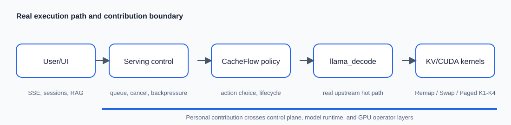
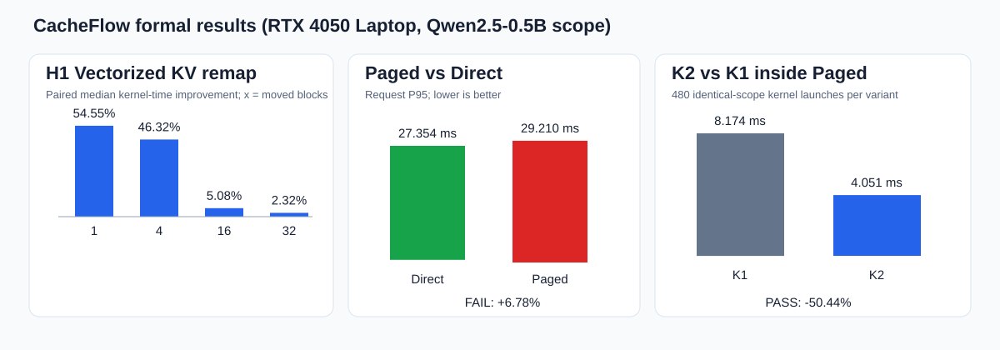
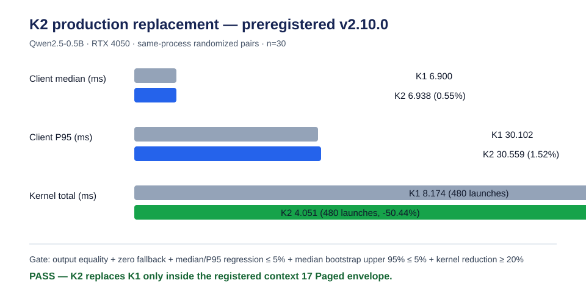
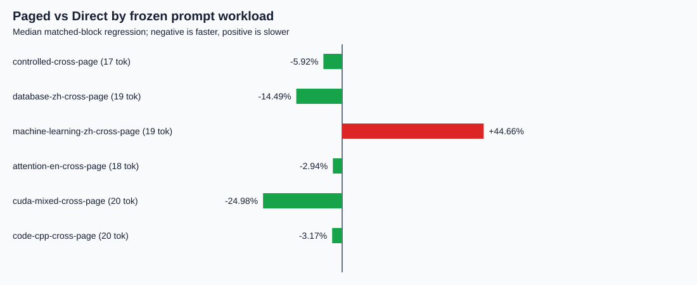
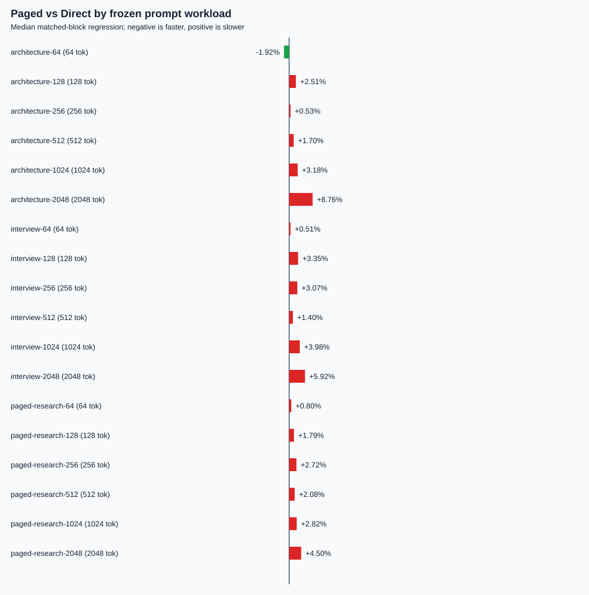
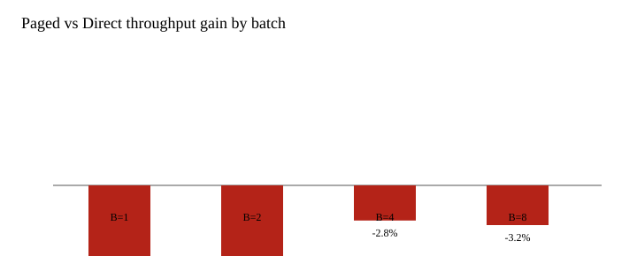
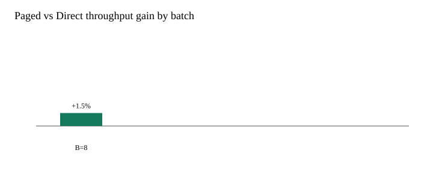

# CacheFlow Runtime 图文总结报告

## 1. 成果是什么

项目不是在 llama.cpp 外层套一层接口，而是把缓存感知调度、KV 生命周期管理和 CUDA 算子接入真实 `llama-server → llama_decode → KV memory → CUDA` 路径。最终形成两项可独立交付成果：一套面向单机/可信局域网的推免面试学习助手，以及一套保留正负结果、可由原始 trials 重算的独立科研型成果。



## 2. 核心创新点

1. **从请求调度贯通到 GPU 数据移动。** 控制面不只决定请求先后，还显式管理 KV 的驻留、抢占、恢复、换入换出和重算，并把决策计数、CUDA event、kernel launch 与请求延迟关联起来。
2. **统一动作代价模型。** 将 Direct、Remap、Swap、Recompute 与受能力门禁约束的 Paged 视为同一动作空间；D3 用有界 ridge 预测动作相对 H0 的增量代价，证据不足时回退 H0。
3. **自研 CUDA KV Remap/Swap。** 用向量化数据搬运取代标量 gather/scatter，并以 CPU oracle、边界/重叠映射和 sanitizer 验证正确性。
4. **Paged Decode 从 K1 演进到长上下文 split-K2。** K1 是每个 query head 一个 CTA 的正确基线；短上下文 K2 针对 GQA7 复用同一 KV head。长上下文版本再把序列切成 32-token tile 和 256-token partition，各 partition 产生可精确合并的 FP32 online-softmax 状态，避免把整段上下文塞进一个 CTA。
5. **证据工程本身是成果的一部分。** 实验先预注册门槛，再生成原始请求、Prometheus、NSYS/SQLite、汇总、图表和 manifest；最终结论由验证器从底层证据重算，负结果不删除。

## 3. 实验数据从哪里来、如何处理

### 3.1 数据来源

- **应用数据**：仓库中的 5 份面试知识文档被切分为 128 个检索块；自动 HTTP/SSE 用户旅程验证后端链路，另有 Codex 内置 Chromium 的交互记录验证浏览器流式完成与会话侧栏显示，再调用固定 Qwen2.5-0.5B 模型。
- **H1 Remap 数据**：CUDA benchmark 在 1/4/16/32 个 block 上分别执行标量与向量化方法；每个规模 20 个 confirmatory 配对，另有 warm-up，正式统计排除 warm-up。
- **H4 策略数据**：同一 trace/session/prefix family 下收集 H0/A1/T1/L1 的动作观测，按 trace 分组并按时间切分，避免同一会话泄漏到训练和留出集。
- **H7/H8 服务数据**：同一进程内交替运行对照臂，固定模型、prompt、输出 token、context 和设备。H7 比较 Direct 与 Paged；H8 在已进入 Paged 路径后比较 K1 与 K2。
- **H9 客观输入矩阵**：prompt 不再嵌入 runner；冻结语料文件包含受控边界、中文数据库/机器学习、英文 Attention、中英混合 CUDA 和 C++ 代码六类输入。30 组随机化匹配进程块中，每个 Direct/Paged 独立进程 arm 都运行全部语料，实际 token 数由模型响应记录而非人工假设；它不是共享热状态 Trial Pair。原始 v2.0.0 协议及哈希保持不动；模型和 vendor-diff 哈希属于实验后的验证修正，只增强可审计性，不冒充运行前预注册或 contemporaneous run binding。
- **H10 来源绑定长上下文矩阵**：从架构文档、面试手册和 Paged 研究笔记抽取正文，经统一 Markdown 归一化后由真实 Qwen tokenizer 截取并反解为 64/128/256/512/1024/2048 token；每条记录绑定源文件 SHA-256、token span、模型哈希和最终实际 token 数。3 个来源族共 18 个 workload，不是 `one one ...` 或 runner 内硬编码字符串。

### 3.2 处理过程

原始记录先做协议一致性检查：请求参数、trial/arm 顺序、PID、计数器增量和响应内容必须完整。H1/H8 在共享状态的 trial pair 内计算差值；H9 与 H10–H14 按随机化匹配进程块比较两个独立进程 arm，不冒充 Trial Pair。不确定性按相应的 pair、匹配进程块或 trace cluster 重采样 bootstrap，以保留相关样本结构。长上下文实验的主指标选 `server_prompt_ms`，因为单 token completion 中被选择的 KV 动作与 attention graph 在 prompt 阶段执行；`predicted_ms=0.001` 只是采样后的量化余量，v3 因误选该字段被完整保留为无效实验。H13 还强制 6/6 平衡臂顺序，并从 raw arm 重建 normalized trials。只有正确性、延迟上界、覆盖范围与零 fallback 同时满足，候选才能晋级。

## 4. 实验结果



- **H1 正结果**：1/4/16/32 blocks 的 kernel 时间配对中位改善为 54.55%、46.32%、5.08%、2.32%。规模越大收益越小，因此只称算子微基准改善。
- **D3 有条件正结果**：留出集 80 个决策中相对 H0 切换 24 次，累计 regret 2.082 ms，harmful decision 1 次；chooser P99 0.900 μs且热路径零分配。它仍是离线 replay，尚不能写成线上普适收益。
- **Paged-vs-Direct 负结果**：P95 从 27.354 ms 上升到 29.210 ms，回退 6.78%，超过 5% 门槛。因此默认启动器不启用 Paged。
- **K2-vs-K1 正结果**：30 组同进程配对、每臂 480 条测量响应和 600 次 Paged graph entry、0 fallback。请求 median/P95 仅回退 0.55%/1.52%，median 回退 bootstrap 95% 上界 2.86%；相同 480 次 kernel 总时长从 8.174 ms 降至 4.051 ms，降低 50.44%。
- **H9 客观矩阵负结果**：6类冻结输入、30组随机化匹配进程块、360个 workload-arm 观测均实际跨页。总体中位数显示 Paged 改善 7.96%，但 block-workload 回退分布P95为 158.62%，最差workload中位回退 44.66%，分别超过20%和5%门槛，因此不能晋级。
- **H10→H13 长上下文根因修复**：H10 的旧 split-K2 主中位回退为 50.35%。K4 用整组 GQA7 复用、`half2` K/V 访问和设备端自适应 partition 重构算子；H13 以 18 个来源绑定 workload、12 个严格平衡的匹配进程块和 432 个 workload-arm 观测覆盖 64–2048 token，合计 3456 个测量请求，输出逐项一致、Paged graph 覆盖完整且 0 fallback。512–2048 token 主区间的 `server_prompt_ms` 中位回退降至 3.98%，cluster bootstrap 95% 区间 [2.50%, 5.38%]，P95 回退 13.34%；算法改进有明确幅度，但置信上界仍未通过 +5% 晋级门。
- **H20 布局感知混合路由正结果**：连续物理页不再强制执行较慢的 custom K4，而是复用 upstream attention；碎片页仍保留页表寻址 K4。batch 8、128/512/1024 token、6 个平衡匹配进程块中，吞吐中位变化 +1.54%，95% 区间 [-2.06%, +3.86%]，P95 wave 延迟变化 -0.76%，1728/1728 输出一致，正式非劣门通过。







### H19：真实批处理不是“计数器看起来像执行”

批处理改造同时覆盖 unified `[D,B,H,1]` 与真实服务默认的 non-unified `[D,1,H,B]`。CPU oracle 用展平后的 sequence row 选择 block table；CUDA 根据 batch 所在维度选择 Q、输出和 K/V stream stride。执行证据不再使用 graph admission 计数，而是由每层 Paged CUDA kernel 的 block 0/thread 0 在设备端原子累加，所以 CUDA Graph replay 也不会漏计。

正式 H19 固定 batch 1/2/4/8、context 128/512/1024、6 个平衡匹配进程块，共 144 个 action-cell、1080 次输出比较。主 batch 8 每个测量 wave 均实现一个 8-sequence graph、24 个逐层 kernel 和 192 个 sequence-layer 执行，0 fallback。结果仍为负：吞吐中位变化 -3.22%，cluster bootstrap 95% 区间 [-4.90%, -0.12%]；P95 wave 延迟回退 16.00%，最差 cell 中位回退 50.49%。输出 token 一致 1052/1080，且 48 行缺少完整概率证据，因此不晋级。



### H20：从强制自研算术核改为布局感知混合执行

NSYS 根因分析显示，H19 的 K4 主 kernel 平均约 40.54 μs，而 upstream Flash Attention 约 26.08 μs；额外 merge 约 1.62 μs，因此问题主要是算术核效率，不是 host 包装。仅把 1024-token partition 从 64 调到 128 虽将 grid 和 scratch 减半，却没有改善主 kernel 时间；实验性 Tensor Core K5 也慢于 K4，因此均未冒充成果。

最终修复把“分页生命周期”与“必须运行自研分页算术核”解耦。block-table builder 检测所有活跃逻辑页的物理基址是否按 page size 连续；若连续，Paged 请求复用 upstream attention；若不连续，才使用 custom K4。H20 的 216 次 fast-path 调用覆盖 1728 条序列，且 custom graph/CUDA dispatch 为 0。吞吐点估计 +1.54%，95% 区间 [-2.06%, +3.86%]，只能称为“有界非劣”，不能称为严格占优；碎片布局 K4 的性能仍由 H19/H13 负结果约束。



## 5. 应用结果与最终边界

应用旅程已覆盖 UI、SSE、并发、取消、429 背压、重启恢复和本地知识检索，并记录 456 个缓存 prompt token、6 次自研 CUDA KV launch、5603330 个向量化 remap 字节。它能作为可运行应用项目和有实验链的 AI Infra 研究项目交付。

最终不能声称“Paged 全面优于 Direct”或“端到端加速 50.44%”。准确结论是：**短上下文受限 Paged 内部，K2 已替换 K1；长上下文 custom K4 将旧 K2 回退显著降低但仍未晋级；生产混合路由在连续 batch-8 矩阵中通过有界非劣门，碎片布局仍 fail-closed 到经过 oracle 验证但性能未晋级的 K4。两臂复用同一底层分配器，本实验不提供碎片率或容量优势证据。**

## 6. 复现与审计

```powershell
.\scripts\verify_final_outcome.ps1
.\scripts\verify.ps1
```

前者重算 H1 并调用 H4/H7/H8 正式验证器，同时校验本报告、最终 JSON、图表和启动器哈希；后者执行全仓快速测试和架构/工件验收。全部源数据路径与 SHA-256 见 [`results/final-outcome.json`](../results/final-outcome.json)。
