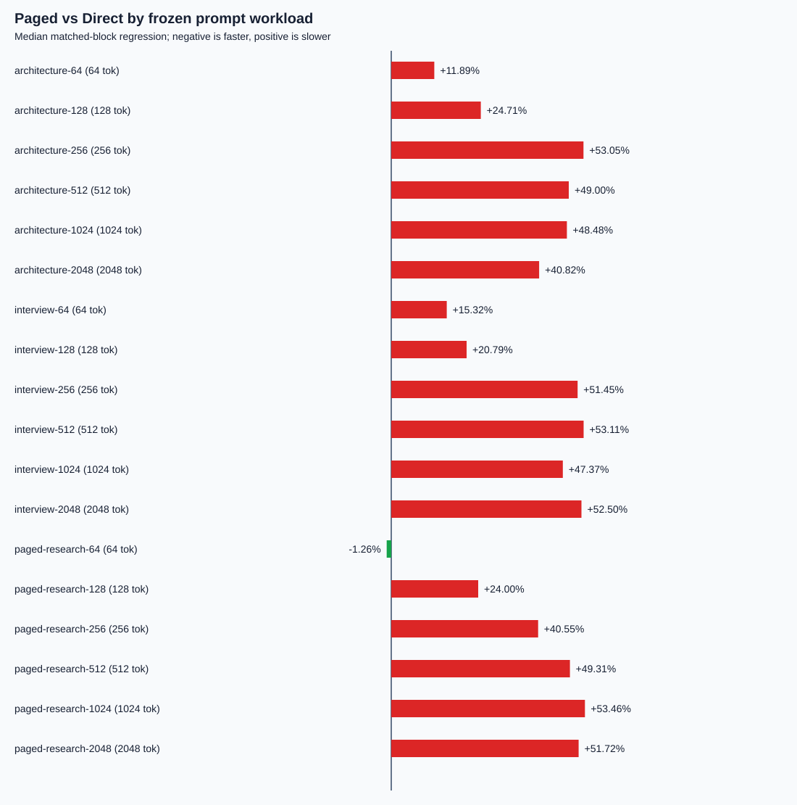

# 长上下文 Paged Decode Attention：算法、数据与客观结果

## 1. 研究问题

Paged Attention 的核心价值是让注意力算子根据页表直接读取不连续的 KV Cache，避免为了计算 attention 先把逻辑序列整理成一段连续内存。但“支持分页”不等于“速度一定更快”：页表寻址、较小的计算规模、CUDA kernel 启动、同步与中间状态写回都可能抵消减少数据整理带来的收益。

本轮回答一个明确问题：在 RTX 4050 Laptop GPU、Qwen2.5-0.5B、batch 1、单 token decode、FP16 KV、page size 16 的固定条件下，把自研 K2 从短上下文扩展到 2048 token 后，是否能在真实 `llama-server` 路径中优于 Direct？结论是：**正确性和覆盖范围达到目标，但在 2048 token 内没有观察到性能交叉点，Paged 不应默认启用。**

这里的 Direct 是 llama.cpp 当前连续 attention 执行路径，Paged 是通过逻辑页表直接读取 KV 的自研执行路径。两者共享项目中的底层 KV 分配器，因此本实验比较的是执行路径，不是“连续预留分配器与分页分配器”的容量或碎片率。

## 2. 为什么原 K2 只能处理短上下文

原 K2 以一个 CUDA Cooperative Thread Array（CTA，即一组能共享 shared memory 并同步的线程）处理两个 query heads。它把当前上下文的 K/V 暂存到 shared memory，再完成 QK 点积、softmax 和 PV 聚合。shared memory 容量固定；如果工作区随上下文线性增长，长度继续增加就会超出资源预算。因此原生产能力门只开放到 32 token。

这不是 Paged Attention 的理论限制，而是第一版 kernel 的并行分解限制。要扩展长度，不能继续让单个 CTA 持有整段上下文，必须把序列拆成可独立计算、最后又能数学等价合并的片段。

## 3. 算法改进

### 3.1 32-token tile

Tile 是一次装入片上存储并处理的小数据块。新 K2 每次只处理最多 32 个逻辑 token：根据页表把它们映射到物理页，从 global memory 读取对应 K/V，并为两个共享同一 KV head 的 query heads 复用加载。上下文再长，单次 shared-memory 占用也不再增长。

### 3.2 256-token partition

Partition 是由若干 tile 组成、可由一个 CTA 独立完成的连续逻辑区间。本实现把长上下文切成最多 256 token 的 partition。第一层 kernel 为每个 partition 计算 softmax 的未归一化状态；第二层 merge kernel 合并所有 partition。当前 host 根据图的最大上下文容量分配 partition，实际长度之外的 CTA 写入中性状态并退出。

分区解决了两个问题：一是单 CTA 不再串行扫描全部 2048 token，二是不同 partition 可以并行执行。代价是增加一次 merge kernel、临时 FP32 状态流量，以及短上下文下可能存在的空 partition 调度开销。

### 3.3 为什么不能直接平均分区输出

Softmax 先取指数再归一化。不同 partition 的最大 logit 不同，分别归一化后直接平均会改变权重，因此结果不等价。每个 partition 必须保留三项 FP32 状态：最大 logit (m)、指数和 (l)、加权但未归一化的值向量 (o)。将当前累计状态与新分区状态 ((m_t,l_t,o_t)) 合并为：

\[
\begin{aligned}
m' &= \max(m,m_t),\\
l' &= e^{m-m'}l + e^{m_t-m'}l_t,\\
o' &= e^{m-m'}o + e^{m_t-m'}o_t.
\end{aligned}
\]

最终输出为：

\[
O=\frac{o}{l}.
\]

这叫 online softmax：无需保存全部 logits，也能在分块或流式读取时保持数值稳定。减去最大值可避免指数溢出；用同一缩放因子重标定旧状态和新状态，保证合并与一次性计算全序列在数学上等价。

## 4. 正确性验证

生产 GGML 算子与独立 CPU oracle 对照。Oracle 是速度不重要但逻辑直接的参考实现：按逻辑 token 顺序通过页表读取 K/V，用 FP32 完成 QK、稳定 softmax 和 PV，再逐元素比较 CUDA 输出。

固定覆盖 24 个边界长度：1、15、16、17、31、32、33、63、64、65、127、128、129、255、256、257、511、512、513、1023、1024、1025、2047、2048。它们分别覆盖页首、页尾、跨页、tile 边界与 partition 边界。所有多页用例反转物理页顺序，确保 kernel 真的通过页表寻址，而不是偶然依赖连续布局。24/24 用例通过；构建脚本中的 CUDA 单元测试、真实模型换入换出与既有回归测试也通过。

对 1025 token 以上用例采用 NMSE 不超过 (6\times10^{-3}) 的门槛。这里的差异来自 GPU 分区归约与通用 CPU reference 的累加顺序不同，并非页索引错误；K1 与 K2 在相同长度呈现同量级差异。

## 5. 输入数据从哪里来

正式 H10 不使用 `one one ...`，也不在 benchmark runner 内硬编码 prompt。语料来自项目内三份真实文档：

1. `docs/architecture.md`：系统架构与推理基础设施内容；
2. `docs/interview-notes.md`：面试知识与项目解释；
3. `docs/research/restricted-paged-decode-attention.md`：Paged Attention 研究内容。

构建器先去除 Markdown 展示噪声并统一空白，再调用同一个真实 `llama-server` 的 `/tokenize` 获取 Qwen token ids；随后按 64、128、256、512、1024、2048 六种精确长度截取并通过 `/detokenize` 还原 prompt，最后再次 tokenize 验证长度。3 个来源族乘 6 个长度，共 18 个 workload。每个 workload 保存源路径、源文件 SHA-256、预处理规则、token span 和实际 token 数，所以不能在不改变哈希的情况下替换输入。

## 6. 实验设计与数据处理

正式协议 v4.0.0 在运行前冻结，绑定 server binary、模型、vendor revision、工作区 overlay、语料和 GPU。实验使用 10 个随机化 matched-process blocks；每个 block 内 Direct/Paged 两个独立服务进程的顺序由固定 seed 随机决定，每个 arm 内 18 个 workload 的顺序也独立随机。

每个 workload-arm 先 warm-up 1 次，再测量 4 次。正式数据共 10×2×18=360 个 workload-arm 单元和 1440 个测量请求。两臂要求生成输出完全一致；Paged 必须进入预期 graph、计数完整且 fallback 为 0。实际覆盖 64–2048 token，即 4–128 个物理页。

主指标是 512、1024、2048 token 上的 `server_prompt_ms`。原因是单 token completion 中，被选择的 KV 动作和 attention graph 在服务端 prompt 阶段执行；响应里的 `predicted_ms=0.001` 只是采样后的量化余量。先前 v3 误把这个无分辨率字段选为主指标，产生全零差值，因此整个原始工件被保留在 `results/research/superseded/` 并明确标为无效，而不是用于支持结论。

对每个进程块与 workload，先分别取四次请求的中位数，再计算：

\[
r=100\left(\frac{T_{Paged}}{T_{Direct}}-1\right)\%.
\]

(r>0) 表示 Paged 更慢，(r<0) 表示 Paged 更快。总体不确定性按进程块整簇 bootstrap 10,000 次，避免把同一进程中的多个 workload 错当成完全独立样本。

## 7. 正式结果

| 实际上下文 | 物理页数 | Paged 相对 Direct 中位回退 |
|---:|---:|---:|
| 64 | 4 | +11.89% |
| 128 | 8 | +24.00% |
| 256 | 16 | +51.45% |
| 512 | 32 | +49.31% |
| 1024 | 64 | +48.48% |
| 2048 | 128 | +51.72% |

主区间 512–2048 token 的整体中位回退为 **+50.35%**，process-block cluster bootstrap 95% 区间为 **[+49.19%, +51.19%]**；回退分布 P95 为 **+63.74%**，最差 workload 的中位回退为 **+53.46%**。输出一致、覆盖与零 fallback 门通过，但性能门全部失败，所以 `promotion_passed=false`，Paged 保持 opt-in。

完整原始行、汇总、协议哈希和文件清单位于 [`results/research/h10-long-context-paged-v4.0.0`](../../results/research/h10-long-context-paged-v4.0.0/report.md)。

## 8. 为什么 Paged 仍慢于 Direct

第一，Qwen2.5-0.5B 的 `14Q/2KV/D64` 计算量很小，Direct 路径已高度成熟；页表寻址和自研 kernel 的固定成本占比很高。第二，split-K2 仍使用标量式 QK/PV 工作与显式 shared-memory staging，没有利用上游 fused attention 已有的向量化或 Tensor Core 路径。第三，partition 方案新增 scratch 写回和 merge kernel；host 又按最大图容量启动 partition，短于容量的部分 CTA 只能快速退出，仍有调度成本。第四，两臂使用同一 KV 分配器，Paged 没有在本 A/B 中获得容量、碎片治理或避免连续预留的系统级收益。

因此问题不是“prompt 太短”这一单一原因。扩展到 2048 token 后，Paged 的绝对工作量增加，但 Direct 仍更快；本轮数据已经否定了“只要输入变长，当前 K2 就自然超过 Direct”的假设。

## 9. 本轮成果与下一步

本轮的有效成果不是虚构一条正曲线，而是：完成真实长上下文算子、建立来源绑定的数据流水线、发现并废弃错误计时指标、运行预注册矩阵、给出有不确定性区间的可复核负结果，并定位瓶颈。

若继续追求 Direct crossover，优先级应为：

1. 用向量化 FP16 load、warp-level MMA 或 Tensor Core 重写 QK/PV，减少标量指令；
2. 让 host 依据实际 context 启动 partition，避免空 CTA；
3. 融合 partial-state 与 merge，或在足够短时选择单 partition K2；
4. 增加多序列 batch，使分页带来的调度与内存复用价值进入实验；
5. 若要证明 Paged 的容量/碎片优势，另建真正的 contiguous-reservation allocator baseline，并测可服务并发数、峰值显存和碎片率，不能从当前执行路径 A/B 推断。

任何下一版都应先冻结协议，再用同一 18-workload 长上下文矩阵重跑；只有正确性、零 fallback、延迟置信上界和最差 workload 同时通过，才允许默认启用。
