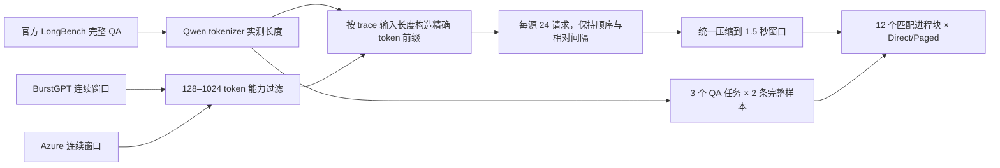

# 官方公开数据工作负载复现实验（H21）

## 1. 这次实验回答什么

旧实验能够回答“固定输入下代码是否执行、算子是否正确”，但不能充分回答面试中的两个常见问题：输入从哪里来，以及换成外部工作负载后结论是否成立。H21 因此把**内容、到达过程和任务标签**分别绑定到公开数据，再进入同一个真实 `llama-server` Direct/Paged 热路径。

这里先定义三类对象：

- **内容数据**：模型真正读取的文本。H21 使用 THUDM LongBench 中完整、未截断的 QA 样本。
- **到达 trace**：每个请求何时到达、输入/输出多长。H21 使用 BurstGPT v2.0 和 Azure LLM Inference Trace 2024。
- **trace-driven public-content synthetic replay**：公开 trace 与公开文本并非同一次真实业务记录，实验只按 token 长度把两者组合并重放。因此它能检验调度与推理性能，但不能冒充真实“内容×到达时间”联合分布。

## 2. 数据来源与冻结

| 数据 | 用途 | 固定版本 / SHA-256 | 本轮实际字段 |
|---|---|---|---|
| THUDM/LongBench | prompt、参考答案、QA F1 | 仓库 `2e00731f...`；官方 `data.zip` 为 `cb45b11...57f7f64` | `input/context/answers/length/dataset/_id` |
| BurstGPT v2.0 | 生产请求到达与 token 长度 | `BurstGPT_1.csv` 为 `4bb37836...9e12122` | `Timestamp/Request tokens/Response tokens/Model/Log Type` |
| Azure LLM Inference Trace 2024 | 外部 trace 复核 | code 一周 trace 为 `71de5c55...23a1448f` | `TIMESTAMP/ContextTokens/GeneratedTokens` |

LMSYS-Chat-1M 是合适的真实对话正文来源，但需要单独同意许可，本轮未取得授权，因此没有把它写成已使用。LongBench-E 也已下载检查，但完整样本超过当前 2048-token Paged 能力上限；为避免截断破坏问题与答案，本轮不报告伪造的 LongBench-E 分数。

所有进入服务的文本、官方行号、本地 tokenizer 实际长度、prompt SHA-256、模型和运行时哈希都保存在 [冻结工作负载](../../results/research/h21-public-external-v1.0.0/workloads.json) 与 v1.3 manifest 中。

## 3. 数据处理过程

性能 replay 覆盖 48 个不同公开 prompt：BurstGPT 输入为 137–991 个本地 token，Azure 为 416–994 个本地 token。两个官方窗口的绝对时间跨度不同，所以只保留顺序和相对间隔，并各自线性压缩到 1.5 秒；这个变换在协议中预先固定。质量集覆盖 `multifieldqa_en`、`2wikimqa`、`triviaqa`，实际长度 1018–1965 token，均为完整样本。

每个 action 都启动全新服务进程；12 个 matched-process block 平衡 Direct-first/Paged-first 顺序。每个请求由独立定时客户端提交，最大实测到达偏差受 100 ms 硬门限制。性能主指标是完成 24 请求所需 wall time换算的吞吐，辅以所有请求原始延迟的 P95；不先对 cell 求中位再伪装成原始 P95。质量指标使用 LongBench 官方英文 QA token F1：小写化、去标点与冠词后计算 token precision/recall 的调和平均，并对多个参考答案取最大值。

## 4. 公开数据暴露并修复了什么

第一次 v1.0 运行记录到 Paged 路由为 0。原因不是数据错误，而是服务把两种生命周期状态错误地共用一个字段：KV action decision 是一次性观察，Paged decode route 却应持续整个生成请求；冷 prompt 在请求开始时没有 resident prefix，也会被先判为 recompute。

修复后，第二次诊断发现 continuous batching 会把 prefill 和 decode token 混入同一图。Paged 是 graph-wide action，只要混入一个 prefill token，整个图就退回 Direct。根修复包含两部分：

1. 独立保存 request-scoped `paged_decode_requested`，不再随着一次性 action observation 清除；
2. 对 Direct/Paged 两臂都使用相同的 phase-homogeneous 图边界，把 prefill 与 decode 分开，避免只改变 Paged arm 的 batch/reduction 形状。

最终每个 Paged arm 中，BurstGPT 的 `192-24=168` 个生成 decode 输入和 Azure 的 `122-24=98` 个生成 decode 输入全部进入路由；12 块合计 **3192/3192 sequence-route entries**、1429 个 fast-path graph、0 custom K4、0 CUDA custom dispatch、0 fallback。也就是说本轮验证的是生产连续布局 hybrid，不是碎片页 custom K4 严格占优。

v1.2 后来发现 8 个客户端 worker 会反压 24 请求的定时提交，最大到达滑移约 1.29 秒，因此保留为历史无效 replay，不再作为正式结论。v1.3 在结果产生前冻结新的调度、证据和统计门槛。

## 5. 正式 v1.3 结果

| 指标 | Direct | Paged hybrid | 结论 |
|---|---:|---:|---|
| 吞吐配对变化中位数 | — | **-0.04%** | 基本持平 |
| 吞吐 block-cluster bootstrap 95% 区间 | — | **[-1.54%, +0.87%]** | 通过预注册 -10% 下界 |
| 请求延迟 P95 | 2482.391 ms | 2511.827 ms | 回退 **+1.19%** |
| P95 回退 block-bootstrap 95% 区间 | — | **[-1.51%, +3.13%]** | 上界通过 +15% 门 |
| 最大客户端到达偏差 | — | **5.605 ms** | 通过 100 ms 门 |
| trace 完整输出 token 序列 | — | **565/576** | 严格相等门失败 |
| 首次分歧前 top-20 最小重叠 | — | **19/20** | 诊断项，不改写失败 |
| 公共 token 的最大 logprob 误差 | — | **0.225273** | 诊断项，不改写失败 |
| LongBench 输出一致 | — | **6/6** | 通过 |
| LongBench 平均 QA F1 | 0.391300 | 0.391300 | 差值 0 |

按任务拆分，Direct/Paged F1 均为：`multifieldqa_en=0.360743`、`2wikimqa=0.050000`、`triviaqa=0.763158`。这些值衡量的是 0.5B 模型在本轮 6 条能力内样本上的绝对任务质量，不是完整 LongBench leaderboard 分数；系统正确性主张是两臂分数和完整质量输出一致。

576 个配对 trace 请求中有 11 个输出序列不一致；分歧集中在少数 trace 行，且两臂跨块都存在近邻候选翻转。v1.3 仍按预注册的 exact-output gate 保持 **FAIL**，没有因为 top-20 高重叠或 LongBench 分数相同而事后放宽门槛。性能、到达过程和 LongBench 质量门虽通过，也不能覆盖这一失败。

## 6. 能说与不能说

可以说：公开数据把“一 token、重复缓存 prompt”的隐藏假设暴露出来，推动了 request-lifecycle 状态解耦和 mixed prefill/decode phase+action 分图；最终真实服务在两个公开 trace 上完整执行 3192 个生成序列路由，吞吐近似持平，LongBench 配对质量完全一致。

不能说：Paged 严格快于 Direct、custom K4 在公开 trace 上获胜、已经完成完整 LongBench/LongBench-E 评测，或 565/576 等于完全正确。当前生产结论仍是 **hybrid 保持 opt-in，严格晋级失败**；下一步应在更多模型/GPU上用 logits 容差与任务质量共同定义数值等价，但必须用新协议确认，不能回写 v1.3。

正式证据：[v1.3 报告](../../results/research/h21-public-external-result-v1.3.0/report.md) · [协议](../../config/public_external_protocol_v1_3.json) · [研究选型](public-workload-dataset-selection.md)。
